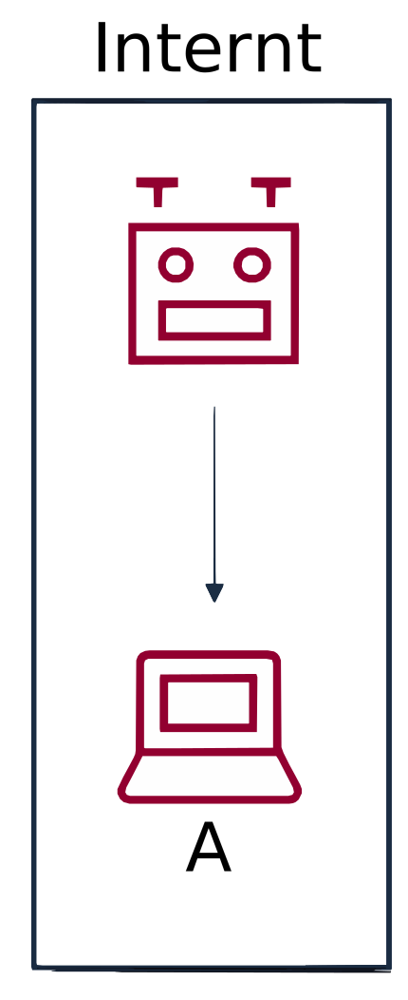
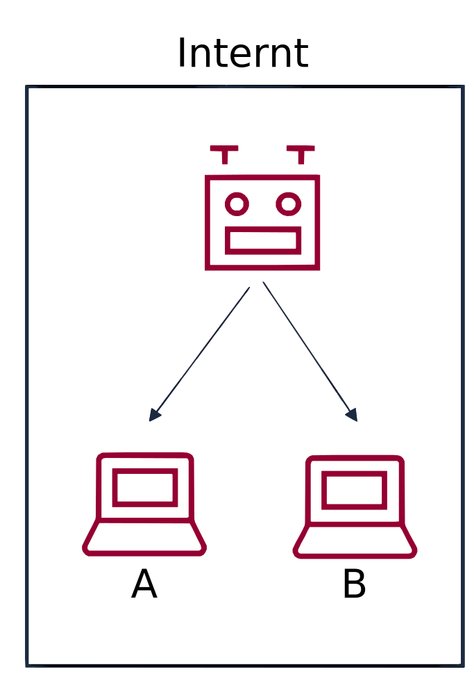
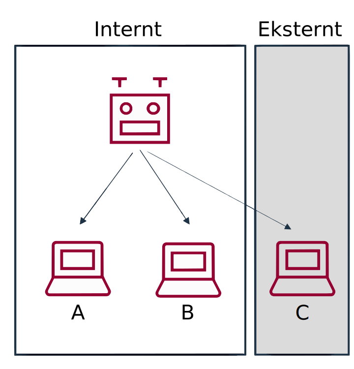

# Erfaringsopsamling om softwarerobotter og brugerstyring

## Introduktion

### Formål, målgruppe og tilblivelse

#### Formål

Formålet med erfaringsopsamlingen er at give praktiske svar på, hvordan der kan laves gode og sikre løsninger til brugerstyring i forbindelse med styring, udvikling og drift af softwarerobotter. Den giver svar på nogle af de centrale spørgsmål, der opstår, når man arbejder med softwarerobotter:

* Hvad skal man have styr på i forbindelse med brugerstyring af softwarerobotter?
* Hvad skal man være opmærksom på i sikkerhedsarbejdet i forhold til softwarerobotter?
* Hvordan understøtter man arbejdet med softwarerobotter i forhold til brugerstyring og informationssikkerhed?

Formålet er også at tydeliggøre, hvordan anbefalingerne fra [Referencearkitektur for brugerstyring](https://arkitektur.digst.dk/rammearkitektur/referencearkitekturer/referencearkitektur-brugerstyring) kan anvendes i det praktiske arbejde med softwarerobotter. Derfor kommer erfaringsopsamlingen med eksempler på god praksis, og hvordan andre myndigheder har gjort. Endelig kommer erfaringsopsamlingen med anbefalinger til en sikker og lovlig håndtering af softwarerobotter, der tager hensyn til gældende lovgivning og rammer for den fællesoffentlige infrastruktur for brugerstyring for så vidt angår kapabiliteter, standarder og politikker.

Brugerstyring defineres som administration og kontrol af brugere, identifikationsmidler og adgang til forretningstjenester.

#### Målgruppe

Erfaringsopsamlingen henvender sig til medarbejdere, der arbejder med styring, udvikling og drift af softwarerobotter primært i offentlig sammenhæng. Erfaringer fra arbejdet med softwarerobotter i det offentlige viser, at der er behov for viden og kompetencer fra både tværgående og domænespecifikke fagligheder. Erfaringsopsamlingen retter sig derfor mod en bred målgruppe, der omfatter RPA-udviklere, RPA-ansvarlige, it-sikkerhedsspecialister, it-revisorer, it-arkitekter, procesejere, processpecialister, fagspecialister og systemforvaltere.

#### Tilblivelse

Arbejdet med erfaringsopsamlingen blev igangsat af Udvalget for Arkitektur og Standarder (UAS) den 1. december 2020. Erfaringsopsamlingen er udarbejdet af en arbejdsgruppe med deltagere fra den offentlige sektor. Følgende organisationer har været repræsenteret i arbejdsgruppen: KL, Region Midtjylland, Region Syddanmark, Statens Administration (SAM), Odense Kommune og Digitaliseringsstyrelsen (DIGST). DIGST har været pennefører, stået for projektledelse og ansvar for arbejdet med løbende at holde erfaringsopsamlingen opdateret.

Erfaringsopsamlingen publiceres på hjemmesiden for den fællesoffentlige digitale arkitektur: [arkitektur.digst.dk](http://arkitektur.digst.dk). Den kan blive opdateret, hvis der sker væsentlige ændringer i de overordnede nationale eller internationale rammer for anvendelse af softwarerobotter i relation til brugerstyring og informationssikkerhed.

### Særlige udfordringer ved anvendelse af softwarerobotter

Når man arbejder med brugerstyring af softwarerobotter, er der nogle særlige udfordringer, som man skal tage højde for.

Det skal altid være helt klart, hvornår det er en softwarerobot, og hvornår det er en medarbejder, der foretager handlinger i en forretningstjeneste.

To eksempler på udfordringer, som mange myndigheder kan stå over for, og som denne erfaringsopsamling forholder sig til, er:

* Når der er behov for at en robot skal tilgå en forretningstjeneste, der er indrettet til anvendelse af en medarbejder, og dermed foretage handlinger, der – som udgangspunkt – kun må foretages af en fysisk person under ansvar.
* Når en medarbejder har adgang til at tilgå en softwarerobots kildekode, kan ændre den og køre den under en anden identitet end sin egen, og dermed åbner mulighed for uønskede eller ulovlige handlinger som fx svig.

I forlængelse heraf er der andre og relaterede udfordringer, som blandt andet kan være:

* Adgangspolitikker og certifikatpolitikker, der er uforenelige med softwarerobotter.
* Manglende sporbarhed af om det er en robot eller en fysisk medarbejder, der har foretaget handlinger i en forretningstjeneste.
* Risiko for uklart ansvar i forhold til handlinger, herunder fejl, som softwarerobotten laver.
* Manglende sporbarhed i handlinger, der foretages i forbindelse med administration af softwarerobotter.
* Utilstrækkelig adgang til testmiljøer og testdata i forhold til de forretningstjenester, som robotterne skal operere på.

Den teknologiske udvikling på området går mod mere avancerede softwarerobotter, som ved brug af maskinlæring og kunstig intelligens kan udføre stadigt mere avancerede opgaver. Det kan åbne for nye sårbarheder og trusler, men fra et brugerstyringssynspunkt er der ikke nogen grundlæggende forskel: der er stadig tale om softwarerobotter med tilhørende identifikationsmidler og rettigheder, som skal styres, selvom der kan være forskel på de rettigheder, der i praksis tildeles. I denne erfaringsopsamling bliver de særlige aspekter vedrørende maskinlæring og kunstig intelligens derfor ikke uddybet yderligere.

### Læsevejledning

Læsevejledningen introducerer erfaringsopsamlingens kapitler og bilag, og guider til anvendelsen af den. Erfaringsopsamlingen er opbygget i tre kapitler, der kan læses i sin helhed, og de suppleres af introduktionen og bilagene. De enkelte kapitler og bilag kan også læses og anvendes særskilt som følge af det konkrete behov. Hvert afsnit i de tre kapitler afsluttes med en tjekliste, som man kan bruge som støtte til at vurdere, hvordan det aktuelle arbejde med robotter forholder sig til de centrale problemstillinger.

De tre kapitler er:

* Brugerstyring af softwarerobotter
* Informationssikkerhed og softwarerobotter
* Understøttelse af arbejdet med softwarerobotter

Kapitlerne suppleres af introduktionen og tre bilag:

* Tjekliste
* Ordbog
* Referencer

**Introduktionen** sætter den formelle ramme for erfaringsopsamlingen. Den beskriver formål og målgrupper og hvem, der har deltaget i arbejdet med den. Desuden beskriver introduktionen særlige udfordringer ved anvendelse af softwarerobotter.

Kapitlet **Brugerstyring af softwarerobotter** sætter med udgangspunkt i Referencearkitektur for brugerstyring de overordnede rammer for erfaringsopsamlingen, og kan derfor bruges som inspiration og støtte til beslutninger om, hvordan arbejdet med robotter kan gribes an, fx hvilke mønstre og metoder, der skal anvendes.

I kapitlets indledende afsnit om **Typer af brugere i robotarbejdet** beskrives de forskellige typer af brugere med hovedvægt på de autonome og overvågede robotter. **Robottens identitet** dykker og ned i robotters identitet og emnet identifikations- og autentifikationsmidler, herunder problematikken med at anvende de personlige MOCES-certifikater til softwarerobotter, hvilket uddybes yderligere i det følgende afsnit **Robottens identifikations- og autentifikationsmidler,** der desuden handler om tildeling og anvendelse af passwords og certifikater. Efter afsnittet om tildeling af **Robottens rettigheder** følger et afsnit om **Robottens adgangsveje** til applikationer, efterfulgt af afsnittet **Adgangskontrol og logning af robotters handlinger** samt **Tillidstjenesters understøttelse af robotanvendelsen**. Kapitlet afsluttes med et afsnit med **Scenarier og mønstre for brugerstyring af robotter** med eksempler af forskellig kompleksitet.

Mange af brugerstyringsudfordringerne er variationer af sikkerhedsproblemer, og derfor beskrives det i kapitlet **Informationssikkerhed og softwarerobotter**, hvordan risikostyring, håndtering af sårbarheder og trusler samt sikkerhedsprocesser kan håndteres i forhold til udvikling og anvendelse af softwarerobotter. Behandling af personoplysninger er også i fokus her.

Kapitlet **Understøttelse af arbejdet med softwarerobotter** er en mere praktisk erfaringsopsamling og beskriver en række overvejelser, metoder og værktøjer, der kan bruges i arbejdet med softwarerobotterne. Ikke mindst når man skal i gang med at arbejde med robotter.

Kapitlet indledes med et afsnit om **Modenhed og porteføljestyring,** der handler om organisering af softwarerobotter og opgaverne omkring dem, der kan ændre sig i takt med udvikling og drift af softwarerobotterne. **Egnethedsvurdering af processer til automatisering** ser på de overvejelser, der går forud for beslutning om at automatisere en proces. **Klassificering af robotter** omhandler klassificering af robotter som udgangspunkt for sikkerhedsprocedurer og tildeling af rettigheder til robotterne. I **Dokumentation af robotter** beskrives det, hvordan dokumentation af softwarerobotterne kan gribes an og hvordan dokumentationen kan bidrage til styring. **Livscyklus og processer i arbejdet med softwarerobotter** sætter arbejdet med robotter og brugerstyring i et livscyklusperspektiv og beskriver hvordan, brugerstyring spiller ind i alle faser af softwarerobottens levetid fra visitering, udvikling og drift til udfasning. **Scoping af softwarerobotter** viser generelle principper og metoder til scoping og versionsstyring af robotterne. I afsnittet **Udvikling af robottens underopgaver i faser** beskrives en metode til opdeling af udvikling i robotten i faser, der minimerer risici i forbindelse med udvikling og test. Kapitlet afsluttes med et afsnit om **Systemlandskab i forhold til robotarbejdet**, der giver et fælles, generaliseret billede af de forskellige komponenter, som indgår og derfor skal tænkes ind i forhold til sikkerhed og brugerstyring.

De tre bilag er tænkt som supplement til de tre kapitler, og de kan bruges som støtte til anvendelsen af erfaringsopsamlingen eller som selvstændige værktøjer i arbejdet med robotter:

**Tjekliste** er en samling af alle de tjeklister, der afslutter afsnittene i de tre centrale kapitler, og som opsummerer de centrale spørgsmål og problemstillinger, som afsnittene giver anledning til. Tjeklisten kan bruges som et selvstændigt værktøj i det løbende arbejde med softwarerobotter.

**Ordbog** er en alfabetisk liste med forklaringer på ord og begreber om brugerstyring. De centrale begreber er løbende beskrevet i teksten, hvor de optræder første gang. Begrebernes definitioner stammer primært fra begrebsmodellen Adgangs- og brugerstyring, der blev udarbejdet i forbindelse med Referencearkitektur for brugerstyring version 1.1.

Under **Referencer** finder man links til de kilder, der er anvendt i forbindelse med udarbejdelsen af erfaringsopsamlingen. Der er også linket til referencerne i teksten, hvor de omtales.

## Brugerstyring af softwarerobotter

Dette kapitel beskriver de centrale elementer i forhold til brugerstyring af softwarerobotter. Alle disse elementer kan ses som en sammenhængende mængde af elementer, der bør overvejes.

### Typer af brugere i robotarbejdet

Når man arbejder med softwarerobotter er der særligt to problemstillinger i relation til brugerstyring, som man skal være opmærksom på:

* Har vi styr på om det er en robot eller et menneske, som tilgår et it-system?
* Har vi styr på de brugere og roller, der tilgår vores forskellige it-systemer, herunder såvel fagsystemer som selve robottens kildekode.

#### Grundlæggende typer af brugere i forbindelse med robotarbejdet

De tre vigtigste typer af brugere, som man skal skelne mellem er:

* Den almindelige medarbejder, fx en sagsbehandler der skal tilgå et fagsystem.
* Udvikleren, der udvikler robotter, og derfor skal have særlig adgang til relevante udviklingsplatforme, testsystemer og fagsystemer.
* Selve robotten der skal have adgang til et eller flere test- og produktionssystemer.

##### Eksempel på opdeling af brugertyper i Statens Administration

I Statens Administrations setup opereres der med tre typer af brugere:

* B-brugere. Personlige brugeridentiteter for almindelige medarbejdere, der fx skal tilgå et fagsystem.
* E-brugere: Personlige brugeridentiteter for software(robot)udviklere med adgang til testsystemer.
* J-brugere: Servicebrugeridentiteter for software(robotter) med adgangsrettigheder til produktionssystemer.

Formålet med en E-bruger er at skille medarbejdere med roller, der giver behov for at tilgå produktionssystemer (B-brugere), fra medarbejdere og eksterne udviklere, der har behov for at tilgå testsystemer (E-brugere).

Argumentet for at benytte en særlig robotbruger til automatisering er, at det på den måde er tydeligt for både fagsystemejer og kunde, hvem der har udført et arbejde eller en proces. Om det er udført af en personbruger eller en robotbruger.

Adgangskoden til en J-bruger skal være mere kompliceret end hos en almindelig bruger, fordi den tit deles mellem fx flere udviklere. Det er kun tilladt at bruge J-brugeren på Statens It’s robotinfrastruktur.

#### Robotten som bruger - autonom eller overvåget

En bruger er i digital sammenhæng én, der har eller skal have adgang til et it-system. Det kan grundlæggende være et menneske der anvender It-systemet gennem en grafisk brugergrænseflade (GUI) beregnet på mennesker eller en softwareapplikation, der anvender It-systemet via en applikationssnitflade beregnet på maskiner (API).

En softwarerobot er en applikation, dvs. software med specifik forretningsfunktion, der afvikles på en maskine. En applikation kan også kaldes system, app eller program.

En softwarerobot er en bruger på linje med andre brugere, men har den særlige egenskab, at den både kan interagere med forretningstjenester som et menneske (via en GUI) og som en applikation/system (via et API).

I praksis er der mange modeller for, hvordan man håndterer en softwarerobot som bruger. En grundlæggende skelnen er, om softwarerobotten agerer som en støtte til en medarbejder, som er den egentlige bruger og under hvis identitet, robotten agerer (en overvåget softwarerobot), eller om den agerer selvstændigt som bruger med egen identitet (en autonom softwarerobot).

I forbindelse med brugerstyring er det således helt centralt at skelne mellem overvågede og autonome robotter. Ofte bruges de engelske termer _attended RPA_ og _unattended RPA_.

##### Overvågede softwarerobotter

En overvåget softwarerobot fungerer som en applikation, en medarbejder kan sætte i gang som en del af sin egen arbejdsproces. Typisk er der tale om orkestreret automatisering, hvor der udelukkende udføres regelbaserede processer via scripts/makroer. Robotten afvikles med den ansvarlige medarbejders identitet på medarbejderens arbejdsstation, som enhver anden applikation, medarbejderen anvender.

Overvågede softwarerobotter bruges typisk til at understøtte tidskrævende processer, der kræver mange handlinger af medarbejderen i en given arbejdsgang. Det kan fx være at hente data fra en anden applikation, som kræver, at medarbejderen skal logge ind og ud af forskellige systemer. Eller det kan være særlige procedurer eller beregninger, som ikke er en del af selve fagsystemet, men fungerer som en slags udvidelse af fagsystemets funktionalitet.

Brugeren kan følge med i de forskellige procestrin og har ansvaret for den automatiserede proces. Dette omfatter også eventuelle behov for personlig underskrift med digital signatur.

Fordi den overvågede softwarerobot kan anses for at udføre en opgave under en specifik medarbejders fulde kontrol, behøver den ikke særlig opmærksomhed, når det kommer til brugerstyring, fordi den agerer inden for rammerne af brugerens login, identitet og ansvar.

Selv en overvåget softwarerobot, der agerer på en GUI, kan dog bruges til at udføre handlinger, der belaste systemet eller omgå forretningsregler fx mange gentagne handlinger som alternativ til batchudtræk. Ligeledes kan brug af softwarerobotter til skærmskrabning være i strid med forretningstjenestens anvendelses-politik og -kontroller.

##### Autonome softwarerobotter

En autonom softwarerobot agerer selvstændigt, skal selv kunne logge ind og optræder med egne digitale identiteter. En autonom softwarerobot kan være designet til at simulere en medarbejder. Det betyder fx, at den kan logge på applikationer gennem en simuleret (robot)arbejdsstation og handle selvstændigt uden brug af en fysisk medarbejders login eller arbejdsstation.

Autonome softwarerobotter bruges typisk til at automatisere gentagne processer, som medarbejdere ellers gennemfører manuelt, fx rutinebaseret sagsbehandling med indsamling af oplysninger, validering, vurdering og beregning på disse samt handlinger som fx godkendelse, der ændrer sagsstatus og eventuelt gennemførelse af betalinger.

En autonom robot skal have sin egen digitale identitet og attributter, der sikrer, at den kun får de nødvendige rettigheder, kun kan foretage lovlige handlinger, og at der er mulighed for logning, kontrol og revision af robottens handlinger.

Læs mere om relaterede emner i afsnittene om [robottens identitet](#robottens-identitet) og om [funktionsopdeling i afsnittet om modenhed](#organiseringen-af-arbejdet-med-robotter).

#### Tjekliste

* Har vi en klar struktur for opdeling af brugertyper, så vi kan kende forskel på hvilke typer af brugere og roller, der tilgår hvilke systemer?
* Har vi sikret, at vi har klare rammer for, om robotten kan være autonom, eller om den kræver overvågning?
* Har forretningstjenesten politikker for _anvendelse_, der bliver kompromitteret ved brug af softwarerobotter fsva. aktivitet og teknikker til fx skærmskrabning?
* Tillader forretningstjenestens adgangspolitik autonome softwarerobotter?

### Robottens identitet

En forretningstjeneste skal kunne vide hvem, der har udført en handling, og om den er udført af en medarbejder eller en softwarerobot. Derfor er det vigtigt at kunne skelne mellem forskellige typer af brugere.

Ideelt set skal man kunne identificere, at der er tale om en softwarerobot, når den optræder som bruger i et system. Robottens digitale identitet skal derfor suppleres med attributter, der tydeligt angiver, at der er tale om en robot, sådan at en forretningstjeneste kan genkende softwarerobotten ved adgangskontrol og logning.

Argumentet for at benytte en særlig robotbruger til automatisering er, at det på den måde er tydeligt for både tjenesteudbyder og tjenesteanvender, hvem der har udført et arbejde eller en proces. Om det er udført af en person eller en robotbruger.

#### Robotten skal have en eller flere identiteter

For at være bruger af et system skal man have en digital identitet, som systemet kan genkende og give adgang, hvis den har rettigheder dertil. En softwarerobot har således behov for en digital identitet, hvis den skal kunne tilgå en forretningstjeneste og udføre sine opgaver. Softwarerobotter skal derfor konfigureres med en digital identitet og et identifikationsmiddel, før de kan optræde som brugere. Ellers kan de ikke genkendes i adgangskontrollen.

Man kan have flere digitale identiteter, som man anvender som bruger. De fleste personer i Danmark har flere digitale identiteter, som giver adgang til fx sociale medier, arbejdsplads-pc’er og digital post. Eksempelvis kan en person have en identitet som borger (baseret på et CPR-nummer) og en anden som medarbejder (baseret på et medarbejdernummer). Det samme gælder kun til en hvis grad for softwarerobotter, hvor forskellige identiteter ikke er nødvendige for at sikre forståelse af dens forskellige roller. Det kan dog være relevant med flere digitale identiteter, hvis den skal tilgå flere forskellige fagsystemer, hvor der er forskellige krav til den digital identitets egenskaber eller begrænsninger på adgang for robotten.

Softwarerobotter, der agerer som brugere på flere systemer, skal således tildeles mindst én og måske flere digitale identiteter, som kan anvendes i den eller de relevante forretningstjenester og eventuelle understøttende tillidstjenester, der tjener som tværgående infrastruktur.

Læs mere i afsnittet [Tillidstjenesters understøttelse af robotanvendelsen](#tillidstjenesters-understøttelse-af-robotanvendelsen).

#### Adgangspolitikker sætter grænser og skal respekteres

Man skal naturligvis sikre sig, at man overholder forretningstjenestens adgangspolitik. Ligeledes skal man overholde de politikker, der er beskrevet hos en eventuel tillidstjeneste, der udsteder identiteten og som dermed er gældende for det elektroniske identifikationsmiddel, som man ønsker at benytte. Det betyder, at det ikke er sikkert, at en robot kan benytte enhver form for identifikationsmidler. Ligeledes er det ikke sikkert, at robotten kan modtage og anvende den type identifikationsmiddel, der bruges til at kontrollere, om brugerens identitet er ægte og pålidelig i henhold til gældende politikker. Eksempelvis kan en softwarerobot ikke anvende fysiske identifikationsmidler som fx et fysisk nøglekort, pas eller kørekort.

#### Attributter, der fortæller, at der er tale om en robot

En digital identitet er en digital repræsentation af en aktør som en person eller fx  en softwarerobot. Selve repræsentationen kan ske ved hjælp af et certifikat, der indeholder et sæt attributter. Disse attributter er egenskaber, der knyttes til en digital identitet, som et brugernavn eller et unikt ID.

Det anbefales at bruge en særskilt attribut til at adskille robotbrugere fra personbrugere. Navngivningsregler er sårbare over for forandring og kan undlades eller omgås, mens certifikater afkobles fra identiteten ved fødereret login og derfor ikke er anvendelig i samtlige scenarier.

Man kan opbygge et medarbejder-ID og et robot-ID efter forskellige standarder. En medarbejder har typisk et medarbejder-ID. Hos Statens IT anvender man eksempelvis et B-nummer som B123456 (B står for bruger). Tilsvarende kan en applikation/robot have et ID opbygget af et præfix (J) og et løbenummer. Ideelt set bør sådanne ID’ er være globalt unikke, men der findes ikke pt. en fællesoffentlig godkendt standard for dette.

Et konkret eksempel er Statens Administration der opererer med en såkaldt J-bruger, som er en teknisk service-bruger-identitet, der kan tildeles adgangsrettigheder til produktionssystemer. En autonom robot etableres med andre ord her som en J-bruger.

Læs mere om i afsnittet [Typer af brugere i robotarbejdet](#typer-af-brugere-i-robotarbejdet).

#### Hvis robotten anvender en medarbejders identitet

Det er ikke god praksis at lade en robot agere autonomt med anvendelse af en medarbejderidentitet. Eksempelvis er brug af et medarbejdercertifikat som MOCES til softwarerobotter ikke tilladt i certifikatpolitikken for de danske MOCES-certifikater.

Det er særligt vigtigt, at der er klare rammer og transparens, hvis en softwarerobot anvender en identitet fra en medarbejder for at tilgå et fagsystem, hvor der som udgangspunkt kun er adgang for fysiske medarbejdere via en grafisk brugergrænseflade. Som hovedregel skal det foregå overvåget, undtaget i de særlige tilfælde hvor reglerne eksplicit og entydigt tillader udlån af identiteter, og de nødvendige sikkerhedsforanstaltninger er truffet.

Det betyder at:

* Medarbejderen skal være oplyst og indforstået med, at robotten agerer som om den _er_ medarbejderen.
* Tjenesteudbyderen skal gennem en klar aftale være indforstået med anvendelsen af robotten.

Det er vigtigt at være opmærksom på, at én af de store udfordringer ved at lade softwarerobotter anvende en medarbejders digitale identitet i forretningstjenester er, at tjenesteudbyderen ikke har mulighed for at opdage og fravælge sig denne type brug, hvis tjenestens adgangskontrol ikke kan skelne mellem softwarerobotter og personbrugere. Dermed svækkes tillidsforholdet mellem tjenesteanvender og tjenesteudbyder. 

Desuden er det vigtigt, at der er god dokumentation af de identiteter, som robottens tildeles.

* Læs mere om [robottens identifikations- og autentifikationsmidler](#scroll-bookmark-9).
* Læs mere om [dokumentation af softwarerobotter her](#dokumentation-af-softwarerobotter).

#### Tjekliste

* Er vores robot opsat med en eller flere digitale identiteter, der kan give adgang til de relevante systemer?
* Er det tydeliggjort i robottens digitale identitet, at det er en robot?
* Er der systematisk dokumentation af den eller de identiteter, roller og rettigheder, den enkelte robot tildeles?
* Er der en klar aftale med tjenesteudbyderen, hvis vores autonome softwarerobot skal logge ind med en medarbejders digitale identitet?
* Er der en klar aftale med den medarbejder, som evt. stiller sin digitale identitet til rådighed for vores autonome softwarerobot?

### Robottens identifikationsmidler

Som alle andre brugere har softwarerobotter behov for et elektronisk identifikationsmiddel, som de kan bekræfte deres identitet med. Det bliver relevant, når de skal tilgå en forretningstjeneste i overensstemmelse med adgangspolitikken.

Et identifikationsmiddel er et middel, som fx en person eller en applikation, får udstedt til brug for autentifikation, og som benytter en eller flere autentifikationsfaktorer.

Login-proceduren kræver typisk, at brugeren præsenterer et ID, et password og eventuelt lever op til supplerende krav til autentifikation som et certifikat eller to-faktor-autentifikation.

En softwarerobot er begrænset i forhold til en fysisk person, da den ikke kan bære rundt på et fysisk identifikationsmiddel, som en NemID nøglekort eller en mobiltelefon.

#### Robottens password

En robot skal kunne logge ind i en forretningstjeneste ligesom et menneske, men der bør stilles andre krav til password end de krav, der stilles til medarbejdere.

Adgangskoden til en robotbruger bør være mere kompliceret end hos en almindelig bruger, fordi den tit deles mellem fx flere udviklere, og robotten ikke har en begrænset hukommelse, der gør komplicerede kodeord uhensigtsmæssige. Af samme årsager bør man overveje om robottens kodeord skal skiftes oftere end almindelige medarbejderes, eller om den blot skal følge samme udskiftningsfrekvens.

Løsninger, hvor robotter arbejder overvåget, bør udvikles sådan, at robotten slet ikke har et password, men i stedet udvikles så den først afvikles efter log-in. Kræver processen flere log-in, så bør dette udføres af medarbejdere undervejs. Alternativt skal den udvikles og afvikles som en autonom løsning med specifik robotbrugeridentitet og ikke anvende medarbejderens identitet.

[Læs mere om gode passwords generelt via dette link til sikkerdigital.dk](https://sikkerdigital.dk/myndighed/tekniske-tiltag/styring-af-password)

#### Certifikattyper

Der findes en række certifikater og certifikatpolitikker. I Danmark er der etableret nationale standarder i form af et sæt af certifikater baseret på OCES standarden. OCES står for Offentlige Certifikater til Elektronisk Service. OCES-familien omfatter pt:

* MOCES – er et medarbejdercertifikat, som gør, at myndighedspersoner kan få adgang til diverse digitale portaler og repræsentere sin arbejdsplads.
* VOCES – er et virksomhedscertifikat, som benyttes til at knytte it-løsninger sammen, og ved at inkludere et VOCES-certifikat bekræfter man, at man er den myndighed, man angiver at være.
* FOCES – er et funktionscertifikat. Formålet med funktionscertifikater er, at virksomheder kan etablere automatiserede forretningsprocesser, som kræver autentifikation og integritetssikring.

Et funktionscertifikat kan alene bruges til autentifikation af en applikation, en enhed, en proces eller service og til integritetssikring og kryptering af kommunikationen herimellem. Et funktionscertifikat skal ikke anvendes til indgåelse af juridisk bindende aftaler.

VOCES- og FOCES-certifikater består af en privat nøgle (og password) og en offentlig nøgle. Certifikatet skal være ens i begge ender af kommunikationsprocessen. Den offentlige nøgle angives under installeringsprocessen, og når datakommunikationen skal etableres, sendes produktionsdataene med den private nøgle (og password). Dermed bekræftes at kommunikationen er korrekt, idet de to nøgler passer sammen.

Den kommende fællesoffentlige infrastruktur med MitID og NemLog-in3 vil fremover understøtte login, som ikke er baseret på certifikater (PKI-teknologi).

Læs mere om [OCES-certifikater her](https://digst.dk/it-loesninger/nemlog-in/om-loesningen/aendring-i-funktionaliteter/certifikater-moces-foces-og-voces/).

#### National Standard for Identiteters Sikringsniveauer (NSIS)

Formålet med NSIS-standarden er at skabe en fælles ramme for tillid til digitale identiteter og digitale identitetstjenester. Den definerer forskellige sikringsniveauer for identitetssikring og autentifikation. Standarden skal skabe større fleksibilitet i forbindelse med identifikation over for forskellige selvbetjeningsløsninger (flere sikringsniveauer). NSIS styrker også samspillet mellem løsninger på tværs af den offentlige sektor.

Bemærk at der ikke findes noget rammeværk for robotidentiteter svarende til NSIS, men at certifikatpolitikkerne vil opfylde en væsentlig del af behovet for at regulere sikkerhedskrav.

Når MitID og NemLog-in3 løsningerne går i luften, vil NSIS samtidig blive taget i fuld anvendelse. Dette medfører en række nye krav til de parter, der ønsker at blive tilkoblet den nationale, digitale identitetsinfrastruktur.

[Læs mere om NSIS her](https://digst.dk/it-loesninger/nemlog-in/anvendelse/nsis-standarden/).

#### Brug af funktionscertifikater

En softwarerobot bør anvende et identifikationsmiddel, der er egnet til applikationer såsom det danske funktionscertifikat FOCES. Brugeradministratoren kan eksempelvis udstede/tilknytte et robotegnet identifikationsmiddel, som fx et FOCES-certifikat i en krypteret PKCS#12 nøglefil med privat nøgle og certifikat, der kan installeres i en robotinstans.  Det er vigtigt, at organisationen, på samme måde som med menneskebrugere, sikrer, at kun den relevante og autoriserede robotinstans har adgang til nøglen.

En del tjenester kan ikke tilbyde systemer og applikationer adgang via f.eks. funktionscertifikater. Der er forskellige årsager til, at der ikke er etableret sådan adgang, idet der i nogle tilfælde er tale om tjenester, hvor tilføjelsen af systemadgang vil være for kompleks og ressourcekrævende. I andre tilfælde er der tale om et bevidst fravalg, der begrundes med sikkerhedsforhold. Dog er der i mange tilfælde også tale om, at behovets omfang ikke er kendt, og at finansieringen af opgaven ikke er til stede. Under alle omstændigheder er det et aftaleforhold mellem tjenesteudbyder og anvender, hvor kredsen af brugere i samarbejde med tjenesteudbyderen bør undersøge mulighederne for at etablere adgange til systembrugere, så der kan etableres adgangsmuligheder for softwarerobotter med dertil egnede certifikater.

### Fødereret adgang gennem Security Token Service

Som beskrevet ovenfor er funktionscertifikater velegnede som identifikationsmidler til softwarerobotter. Nogle tjenesteudbydere understøtter direkte adgang med et funktionscertifikat til deres tjenester, eksempelvis hvor funktionscertifikatet bruges til at etablere en gensidigt autentificeret TLS-forbindelse mellem softwarerobot (klient) og tjeneste-API (server), der sikrer et servicekald. I nogle tilfælde er der også etableret adgang med funktionscertifikat til tjenestens GUI

Selvom direkte integrationer ofte er enkle at etablere, kan de resultere i en uønsket tæt kobling mellem anvender og tjenesteudbyder, idet alle tjenesteudbydere herved skal kende alle anvendere - og vedligeholde deres identitet og adgange decentralt. Hvis en softwarerobot eksempelvis skifter funktionscertifikat, vil man potentielt skulle underrette og opdatere samtlige tjenester, som certifikatet anvendes mod. En arkitektur med direkte integrationer skalerer derfor dårligt, medfører let en stor administrationsbyrde, og gør det vanskeligt at få et overblik over en robots adgange på tværs af tjenester.

Referencearkitekturen for brugerstyring version 1.1 beskrives en række arkitekturmønstre som kan etablere en større afkobling baseret udstedelse og konsumering af adgangsbilletter (_security tokens_). Disse mønstre kan direkte anvendes i et robot-scenarie gennem introduktion af en Security Token Service (STS) komponent. Denne har ansvaret for at kende klienter og tjenester og udsteder adgangsbilletter til tjenesterne. STS-komponenten er således helt analog til IdP-komponenter og finder blot anvendelse på systembrugere (herunder softwarerobotter med funktionscertifikater) frem for menneskebrugere (med NemID eller MitID).

Princippet ved fødereret adgang gennem en Security Token Service er som følger:

1. Robotten (klient) anmoder Security Token Servicen om en adgangsbillet til en bestemt tjeneste (API). Robotten autentificerer sin anmodning med sit funktionscertifikat.
2. STS'en verificerer anmodningen, kontrollerer at der anmodes fra en kendt klient (softwarerobot) og at denne er tildelt adgang til den tjeneste, som der er angivet i anmodningen.
3. Hvis anmodningen kan imødekommes, udsteder STS'en en adgangsbillet (_security token_) målrettet tjenesteudbyderen og underskriver denne med sin digitale signatur.
4. Adgangsbilletten returneres til robotten.
5. Robotten foretager et servicekald til tjenesten og medsender adgangsbilletten.
6. Tjenesten modtager servicekald og verificerer adgangsbilletten, herunder at den er udstedt af en betroet STS og indeholder de rettigheder, som er nødvendige for at udføre servicekaldet.

Typisk vil en STS trække på et rettighedsadministrationssystem til at afgøre autoriseringer og dermed indholdet af de adgangsbilletter, som udstedes. En sådan fødereret model giver en løs kobling mellem anvendere og tjenesteudbydere samt mulighed for effektiv administration samt overblik over adgange på tværs af tjenester.

Referencearkitekturen for brugerstyring beskriver yderligere detaljer om dette arkitekturmønster, herunder de fællesoffentlige standarder, som er udviklet (OIO IDWS). Endvidere kan det nævnes, at NemLog-in har implementeret en Security Token Service baseret på OIO IDWS standarderne, som kan understøtte ovennævnte scenarie.

### Brug af medarbejdercertifikater

Softwarerobotter kan benyttes i forlængelse af et medarbejdercertifikat, som fx NemID (MOCES), hvis identiteten ikke overdrages til robotten, og der føres tilstrækkeligt opsyn og kontrol. Virksomheder og myndigheder har typisk administrative opgaver, der kræver adgang til eksterne systemer, hvor autentifikation fx foretages af NemLog-in, da den pågældende tjenesteudbyder abonnerer på denne løsning til adgangs- og brugerrettighedsstyring.

Eksempelvis har kommunernes kontrolenheder ofte behov for at benytte banklogin, og der automatiseres også processer, der involverer bestilling af blanketter på [virk.dk](http://virk.dk/) og [politi.dk](http://politi.dk/). I disse tilfælde er det som udgangspunkt ikke tilladt at lade softwarerobot logge ind på vegne af en medarbejder, og der er derfor brug for at løse det med føderation eller finde alternativer som fx API’er.

Det er tilfældet, hvor en kommune har behov for at sammenstille gældssaneringer fra Statstidende med borgere i kommunens debitorsystem. Fordi der ikke findes CPR-numre i Statstidendes gældssaneringer, må kommunen anvende Serviceplatformen til at finde CPR-nummer ud fra navn og adresse. Serviceplatformen kræver login med MOCES-certifikat, men har et API, som softwarerobotten kan anvende i processen.

*Figur 2 Proces, hvor en kommune sammenstiller gældssaneringer fra Statstidende med borgere i kommunens debitorsystem.*

Læs mere på KL’s hjemmeside om hvordan [robotter hjælper Horsens Kommune](https://videncenter.kl.dk/cases/nyheder/robot-hjaelper-horsens-kommune-med-at-finde-oekonomiske-udestaaender/).

I forhold til anvendelsen af softwarerobotter skelnes imellem om softwarerobotter opererer overvåget eller autonomt. Førstnævnte foregår ved, at medarbejderen foretager log-in, starter robotten og foretager kontrol af dens arbejde. Sidstnævnte benyttes ofte i forbindelse med større batch-operationer, hvor der ikke er behov for trinvis menneskelig indgriben, og det er særligt denne anvendelse, der er problematisk i forhold til anvendelsen af medarbejderes identiteter.

#### MOCES certifikatpolitikken og brug af softwarerobotter

NemID MOCES certifikatpolitikken er meget klar i forhold til, at brugere skal være i enekontrol over certifikatet idet:

Certifikatholders private nøgle må ikke kunne anvendes, uden at certifikatholderen i hvert tilfælde har autoriseret anvendelsen, således at certifikatholderen opretholder enekontrol over sin private nøgle.

Med udgangspunkt i den nuværende MOCES certifikatpolitik skal brug af autonome softwarerobotter, der selv foretager log-in med medarbejdercertifikater betragtes som et brud på certifikatpolitikken.

Softwarerobotter anvender typisk personlige certifikater, når applikationer er konstrueret til at forvente autentifikation med et identifikationsmiddel, som alene må anvendes af personbrugere, fx et MOCES-medarbejdercertifikat. Her kan den autonome robot ikke få adgang – med mindre et menneske bryder reglerne og kompromitterer sikkerheden og vilkårene for medarbejdercertifikater ved at videregive identifikationsmidler til robotten. Hvis identifikationsmidlerne gives videre, er det med risiko for de implicerede processer og de medarbejdere, hvis identitet anvendes af robotten. De medarbejdere vil nemlig hæfte for samtlige af robottens handlinger i løbet af en session, da de udførte handlinger foretages på et personligt bindende grundlag, og det er ikke muligt at skelne mellem, hvornår handlingerne foretages af en medarbejder og en robot.

Anvendelsen af softwarerobotter med en NemID medarbejdersignatur kan derfor kun betragtes som acceptabel, hvis anvendelsen iværksættes overvåget efter medarbejderens eget login på tjenesten og identiteterne ikke benyttes autonomt i signeringsøjemed.

#### Tjekliste

* Er vi opmærksomme på de ændringer, der sker i forhold til certifikatanvendelsen i forbindelse med MitID og ny NemLog-in løsning, der implementeres fra 2021?
* Har vi sikret, at autonome robotter kan opnå adgang med egne identifikationsmidler, fx med VOCES-/FOCES-certifikat eller STS?
* Er vores robot opsat med identifikationsmidler, der kan give adgang til de relevante systemer i overensstemmelse med regler?

### Robottens rettigheder

I forbindelse med brugerstyring kan fysiske personer eller organisationer have rettigheder og pligter og mulighed for at delegere eller videregive disse rettigheder. En organisation kan delegere rettigheder til en fysisk medarbejder eller til en applikation, der kan være en softwarerobot. En softwarerobot har som andre applikationer ikke juridiske rettigheder eller pligter i sig selv, men kan arve rettigheder via delegation og dermed agere på vegne af personer eller organisationer. Det er altså igennem videregivelse af rettigheder, at softwarerobotter kan opnå rettigheder og derigennem adgang til forretningstjenester.

Typisk vil rettighedsstrukturen i et fagsystem være defineret med henblik på personbrugere. Softwarerobotter har ofte et mere snævert defineret arbejdsområde end fysiske medarbejdere, og den har derfor typisk ikke behov for samme mængde af rettigheder. Hvis det er muligt, kan man derfor oprette brugertyper, som specifikt er designet og konfigureret til en softwarerobot.

Best practice vil være at følge princippet om så få rettigheder som muligt (_principle of least privilege_). Princippet betyder, at man kun giver en softwarerobot de rettigheder, der er nødvendige for at udføre den tilsigtede funktion. For eksempel behøver en softwarerobot, som har det ene formål at inddatere visse data, ikke at kunne slette data. Den har derfor kun rettigheder til at inddatere. Alle andre rettigheder såsom sletning er blokeret.

#### Signering og segl i relation til softwarerobotter

En softwarerobot har ikke ret til at signere. Digital signatur anvendes personligt af fysiske personer. Derimod kan digitale segl anvendes af robotter på vegne af juridiske personer (organisationer).

Der findes use cases, hvor signering optræder som den afsluttende del af en transaktion, hvilket er normalt for processer, der involverer indberetninger og anmeldelser hos især offentlige myndigheder. Det er problematisk, hvis det er en robot, der signerer/underskriver, da en underskrift skal være en eksplicit, utvetydig viljeshandling fra den person, der underskriver. I stedet bør softwarerobotter i den type situationer anvende elektroniske segl.

Kvalificerede, elektroniske segl er en bindende elektronisk signatur afgivet af en juridisk enhed (organisation); dvs. udført af en medarbejder i organisationen med særlige rettigheder til at underskrive på organisationens vegne. Elektroniske segl kan også udføres af et it-system som en “teknisk signatur”.

#### Samtykke og fuldmagt i relation til softwarerobotter

En softwarerobot er ikke en fysisk eller juridisk person og har derfor ikke ret til at give samtykke eller fuldmagt.

En softwarerobot kan til gengæld agere på grundlag af en hjemmel givet gennem et samtykke eller en fuldmagt, som er udfærdiget af en person, fx en borger eller en medarbejder på vegne af en organisation.

#### Løbende kontrol af brugere og deres rettigheder

En væsentlig del af god og sikker brugerstyring er løbende kontrol med, at der er det rette match mellem organisationens definerede brugere og deres identiteter, roller og rettigheder. Det gælder uanset om der er tale om softwarerobotter eller andre typer brugere.

Denne opgave omfatter at sikre, at en bruger ikke har unødvendige rettigheder såvel som at slette ikke-relevante brugere. Det gælder således også, hvis en robotbruger fx udfases eller ikke længere skal eller må anvendes på en given forretningstjeneste.

Processen med at tjekke sammenhængen mellem identiteter, roller og rettigheder kan i praksis automatiseres eller støttes af en softwarerobot. Men det er altid organisationens ansvar at have styr på rettigheder i egne systemer. Oftest kan man pege på en organisatorisk rolle, der har det endelige ansvar. Det betyder, at en fysisk person påtager sig rollen og står til ansvar. Det er typisk en leder med rollen som systemejer.

I nogle tilfælde ser man, at robottens identitet bliver håndteret som en del af det brugerstyrings-setup, som også håndterer almindelige medarbejdere. Her bliver robotten indplaceret under en afdelingsleder, der kan have ansvaret for at vurdere, om robotten kun har de nødvendige og tilstrækkelige rettigheder. I andre tilfælde bliver robotterne samlet i en “robotafdeling”, hvor en ansvarlig medarbejder har tilsynsopgaven.

#### Tjekliste

* Har vi sikret at robottens rettigheder er begrænset til det nødvendige og tilstrækkelige (least privilege)?
* Er der procedurer i vores brugeradministration, der sikrer, at der løbende/jævnligt ryddes op i robotbrugere og deres rettigheder?
* Har vi sikret, at der ikke er behov for en medarbejders digitale signering i processen, hvis robotten skal agere autonomt?
* Er ansvaret for kontrol med identiteter, roller og rettigheder entydigt placeret?

### Robottens adgangsvej

I praksis kan softwarerobotter tilgå applikationer igennem en udstillet teknisk snitflade (API som man typisk ville lade en applikation tilgå, eller robotten kan tilgå en grafisk brugergrænseflade (GUI), som en fysisk person ville gøre det. Endelig er der den mulighed, at robotten får adgang til at læse og skrive direkte til databasen.

I nogle forretningsprocesser giver det mening for en softwarerobot at have adgang til flere typer snitflader, fx hvis robotten skal agere på to forskellige systemer, hvor det ene system ikke tilbyder et API, men kun en GUI.

### Adgang via API

Det bør altid være første prioritet at gå efter API med mulighed for at benytte et funktionscertifikat (FOCES).

Selvom den generelle anbefaling er API som snitflade, når det er muligt, kan der både være konkrete fordele og bindinger, som gør, at det er relevant at programmere en softwarerobot op mod den grafiske brugergrænseflade.

### Adgang via brugergrænseflade

Mange softwarerobotter er designet som en kopi af en brugers handlinger og adfærd i en given applikations brugergrænseflade. Integration via GUI er en gængs metode i forhold til softwarerobotter, fordi denne metode typisk sikrer, at der er styr på forretningslogikken. Det er relativt let at programmere, og det er måske ikke muligt at programmere op imod et API. GUI integration anvendes især op imod løsninger, der ikke stiller egnede API’ er til rådighed, og hvor systemerne ikke let kan ændres. Det er typisk legacy-systemer, hvor funktionaliteten i det enkelte system er udviklet til at skulle tilgås af en personbruger via en grafisk brugergrænseflade.

Hvis adgangen sker via GUI, skal der naturligvis tages højde for de særlige udfordringer, der knytter sig til, at softwarerobotter anvendes med et NemID medarbejdercertifikat (MOCES), hvilket kun kan foregå overvåget og med medarbejderens eget personlige log-in, før robotten startes jf. afsnittet om certifikater.

[Læs mere om certifikater i afsnittet Robottens identifikations- og autentifikationsmidler](#robottens-identitet)

### Adgang direkte til databasen

Skrivning direkte til database vil typisk være en sidste udvej. Her er udfordringen, at der skal tages særligt højde for en korrekt forståelse af forretningslogik, for at undgå fejl.

De forskellige tilgange til integration har naturligvis stor betydning for brugerstyring, herunder mulighederne for at anvende forskellige typer af certifikater.

#### Tjekliste

* Følger vores softwarerobot de gældende certifikatpolitikker i forhold til, om den tilgår en forretningstjeneste overvåget via GUI med anvendelse af en medarbejders personlige log-in, eller opererer den autonomt fx via et API?

### Adgangskontrol og logning af robotters handlinger

Softwarerobotter skal typisk agere i forretningstjenester, som kan være interne eller eksterne. Det er forretningstjenestens ansvar at udforme en adgangspolitik og at udføre adgangskontrol og logning af de handlinger, som brugerne udfører.

#### Adgangskontrol af robotten

Adgangskontrol er den proces, der afgør hvilke funktioner og data en bruger får adgang til på baggrund af brugerens attributter og tjenestens adgangspolitik.

I praksis kan der være stor forskel på, hvordan adgangskontrollen bliver udført, og hvilke krav der bliver stillet til brugere, afhængig af om man ønsker at tilgå en forretningstjeneste igennem en GUI eller et API. Da det, ret unikt, er muligt for softwarerobotter at gøre begge dele, skal man som udvikler og brugeradministrator være opmærksom på, hvordan adgangspolitikken bliver håndhævet i de konkrete snitflader, man ønsker at tilgå systemet igennem.

Hvis adgangskontrollen kræver brug af et fysisk identifikationsmiddel, vil der være behov for at den støttes/overvåges af et menneske ved log-in, hvorved det er personbrugeren, der bærer ansvaret.

#### Adgangspolitik i forhold til robotter

Det er ejeren af forretningstjenesten (det it-system man vil have adgang til), der bestemmer, hvad der skal til, for at man kan få adgang, fx med en softwarerobot. Forretningstjenester har ansvar for at beskrive kriterierne for det sikringsniveau, de kræver. De beskriver kriterierne i deres adgangspolitik, som kan administreres af en specialiseret tillidstjeneste, der administrerer adgangskontrol på vegne af ejeren af forretningstjenesten.

Det krævede sikringsniveau kan med fordel ensartes på tværs af myndigheder og evt. sektorer baseret på et rammeværk for tillid til softwarerobotter og andre applikationer, der modsvarer NSIS og tager udgangspunkt i certifikatpolitikkerne. På den måde stilles der ensartede krav til anvendere af softwarerobotter, og forretningstjenesterne kan referere aftalte sikringsniveauer.

Det er vigtigt at være opmærksom på hvem, der kan påvirke, igangsætte og anvende robotten. Derfor er det en god idé at lave en adgangspolitik for hvem, der kan få adgang til at rette i robottens kode, igangsætte robotten og eventuelt anvende dens digitale identitet.

#### Logning og sporing af robotter

For at man kan logge og spore en softwarerobots aktiviteter, er det afgørende, at det er muligt at identificere, at en given bruger er en robot, jf. afsnittet om softwarerobotters identitet. [Læs mere i afsnittet Robottens identitet.](#robottens-identitet)

Læs mere i afsnittene [Livscyklus og processer i arbejdet med softwarerobotter](#livscyklus-og-processer-i-arbejdet-med-softwarerobotter) og [Systemlandskab i forhold til robotarbejdet](#systemlandskab-i-forhold-til-robotarbejdet).

#### Tjekliste

* Er der lavet en adgangspolitik for hvem, der kan få adgang til at rette i robottens kode og anvende dens digitale identitet?
* Indgår robotten i organisationens løbende konfigurering og kontrol af digitale identiteter og rettigheder, så den ikke har flere rettigheder end nødvendigt?
* Er det tydeligt, hvem der har ansvaret for robottens handlinger?
* Har vi sikret, at det kan spores i hele processen, at det er en robot, der har ageret, og ikke en medarbejder? Fx gennem robottens ID, adgangsbillet (token) eller anden form for dokumentation

### Tillidstjenesters understøttelse af robotanvendelsen

Brugeradministration og adgangskontrol kan udføres af tillidstjenester (_trust services_) på vegne af forretningstjenester.

Det er vigtigt at skelne mellem forretningstjenester og tillidstjenester. Forretningstjenester er tjenester, der understøtter forretningskapabiliteter gennem en eksplicit defineret snitflade, og som er eksplicit styret af en organisation. Tillidstjenester er tjenester, der udfører betroede funktioner, der understøtter brugerstyring i forretningstjenester.

Det anbefales generelt at adskille de to typer af tjenester. I nogle tilfælde håndterer forretningstjenester selv adgangskontrol, men det er frarådet i offentlige systemer. Anvendelsen af specialiserede tillidstjenester giver nemlig bedre mulighed for at lave såkaldte føderationer, der kan indgå aftaler om sammenhængende brugerstyring på tværs af flere forretningstjenester.

#### Valg af tillidstjeneste

Når man som ejer af en forretningstjeneste skal vælge tillidstjeneste, er det vigtigt at være opmærksom på, om det er relevant for robotter at tilgå tjenesten. Hvis det er tilfældet, skal man vælge en eller flere tillidstjenester, så man kan understøtte fysiske personer såvel som applikationer, fx en softwarerobot.

Ved at vælge en autentifikationstjeneste, der er adskilt fra forretningstjenesten, vil man kunne opnå an afkobling af robottens identifikationsmidler fra dens identitet. Såfremt der er aftalt – gerne på tværs af myndigheder eller sektorer – kriterier for tillid til softwarerobotter i form af et sikringsniveau for autentifikationen, er det dermed muligt at genbruge den samme adgangspolitik til robottens adgang via GUI, som ellers anvendes for tjenestens personbrugere.

Når man som serviceanvender (robotejer) skal tildele sin softwarerobot en identitet, skal man omvendt sikre sig, at man har overblik over de muligheder, der er i forhold til anvendelse af robotter på den enkelte forretningstjeneste. Hvis der ikke er passende muligheder, må man overveje at gå i dialog med udbyderen af forretningstjenesten, om der kan åbnes op for adgang for softwarerobotter, fx ved anvendelse af en relevant tillidstjeneste.

#### Eksempler på danske tillidstjenester

De mest kendte eksempler på danske tillidstjenester, som anvendes i den offentlige sektor, er NemLog-in, Unilogin, WAYF og Fælleskommunal Adgangsstyring.

Hertil kommer den danske eID-gateway, som har ansvar for at kommunikere med de andre europæiske gateways og håndtere udveksling af personoplysninger om borgere med et udenlandsk eID.

#### Tjekliste

* Har vi overblik over hvilke tillidstjenester, vi skal anvende i forbindelse med vores softwarerobotter?
* Har vi styr på om deres politikker giver mulighed for at anvende softwarerobotter til de relevante opgaver?

### Scenarier og mønstre for brugerstyring af robotter

#### Simpelt set-up: Robot på ét internt system

I dette scenarie opererer robotten på et enkelt internt system.

*Figur 3 Figuren viser en robot, der agerer på ét internt system.*

Krav til brugerstyring er relativt simple i dette setup, fordi de udelukkende er bestemt af de retningslinjer og muligheder, der er for det pågældende system. Governance og adgangspolitik ligger hos en enkelt systemejer med ansvar for forretningstjenesten.

Her bør man særlig være opmærksom på mulighederne for at identificere robotten som bruger.

Når en softwarerobot tilgår én intern forretningstjeneste, er brugerorganisation og tjenesteudbyder en del af samme organisation, og dermed er der tillid mellem dem. Også hvis de tilhører forskellige organisatoriske enheder i organisationen.

Selvom det betyder, at der ikke er behov for et rammeværk for tillid til eksterne parter, og organisationen i princippet kan skræddersy både softwarerobot og adgangspolitik til de specifikke, umiddelbare behov, bør man alligevel være opmærksom på følgende:

* at oprette softwarerobottens identitet(er) og rettigheder i organisationens centrale brugeradministration, så den på sigt kan anvendes på tværs af forretningstjenester, og så der er sammenhæng til organisationens generelle styring af livscyklus for fornyelse, nulstilling af kodeord osv. Det gør det også nemmere at håndtere, hvis opgaveløsningen og dermed delegationen af rettigheder flytter mellem organisatoriske enheder.
* at oprette softwarerobotten med samme attributsæt som forventes til en medarbejderidentitet med en tydelig markering af, at der er tale om en robotidentitet. Dermed kan softwarerobotten tilgå en eller på sigt flere forretningstjenester uden at ændre (væsentligt) i forretningstjenesternes adgangspolitikker.

#### Semi-komplekst set-up: Robot på to eller flere interne systemer

I dette scenarie opererer robotten på to (eller flere) interne systemer.

*Figur 4 Figuren viser en robot, der opererer på to interne systemer.*

Her er kravene til brugerstyring lidt mere komplekse, idet de nu er er bestemt af de retningslinjer og muligheder, der er for hver enkelt af de pågældende systemer. Governance og adgangspolitik ligger her hos en eller flere systemejere med ansvar for de involverede forretningstjenester, hvilket øger kompleksiteten.

Her bør man særligt være opmærksom på mulighederne for at identificere robotten som bruger på tværs af systemerne med en sporbarhed, der både går på tværs af systemgrænser og administrative grænser.

Når en softwarerobot tilgår flere interne forretningstjenester, gælder det fortsat, at brugerorganisation og tjenesteudbyder er en del af samme organisation, og at der dermed er tillid mellem dem. Identitet(er) og rettigheder vil ofte være oprettet i organisationens centrale brugeradministration.

Foruden ovenstående anbefalinger til det simple setup bør man være opmærksom på følgende:

* Man bør afgrænse softwarerobottens funktionalitet med henblik på at begrænse afhængigheder til to eller flere forretningstjenesters omskiftelige adgangspolitikker og bagvedliggende arbejdsgange og lovgrundlag, der kan afspejles i ændringer i brugergrænseflader og API’ er.
* Man bør begrænse rettighederne for softwarerobotter med tværgående funktionalitet mest muligt. Hvis de skal tilgå forskellige forretningstjenester med forskellige krav til attributter i deres adgangspolitikker, kan det give et uhensigtsmæssigt samlet sæt rettigheder. Det er særlig vigtigt, hvis der er en risiko for at kombinationen af rettigheder kan føre til kompromittering af data.

#### Komplekst set-up: Robot på et eller flere interne og eksterne systemer

I dette scenarie opererer robotten på et enkelt, to eller flere interne systemer samt - og det er den afgørende forskel - på et eksternt system.

*Figur 5 Denne figur viser en robot, der opererer på to interne og et eksternt system.*

Her er kravene til brugerstyring lidt mere komplekse, idet de nu er er bestemt af de interne eller eksterne retningslinjer og muligheder, der er for hver enkelt af de pågældende systemer. Governance og adgangspolitik ligger her hos flere systemejere med ansvar for de involverede forretningstjenester, og det er afgørende, at der er styr på rammer for anvendelse af den eksterne tjeneste gennem overholdelse af dennes adgangspolitik. Dette er særligt vigtigt og kan være en udfordring, hvor der ikke er en API-adgang, men alene adgang via en brugergrænseflade (GUI), og hvor opsætning fx som udgangspunkt kræver adgang med NemID/MitID.

Læs mere om problematikken om brug af medarbejderidentiteter [i afsnittet Robottens identifikations- og autentifikationsmidler.](#robottens-identitet)

Man bør være særligt opmærksom på muligheder - og eventuelle begrænsninger - for at identificere robotten som bruger på tværs af systemerne.

Når en softwarerobot tilgår en eller flere interne og eksterne forretningstjenester, er brugerorganisation og tjenesteudbyder ikke alle en del af samme organisation, hvorfor der er behov for mere eksplicit tillid, end når alle parter er under samme ledelse. Det kan opnås med et tillidsrammeværk som NSIS, men NSIS omfatter kun fysiske personer og ikke robotidentiteter. I Referencearkitektur for brugerstyring lægges der op til, at denne udfordring kan løses ved at beskrive tilsvarende sikringsniveauer med afsæt i certifikatpolitikkerne, så en autentifikationstjeneste kan medsende et sikringsniveau, der gælder for robotidentiteter.

I et scenarie som dette, hvor brugerorganisation og tjenester henholder sig til samme tillidsrammeværk, vil der kunne etableres en føderation med henblik på at autentificere og videreformidle digitale identiteter på tværs af forretningstjenester og organisatoriske og sektorielle grænser mest muligt. En føderation er en sammenslutning af tillids- og forretningstjenester med gensidig tillid.

I scenarier med to eller flere interne og eksterne forretningstjenester kan man med særlig stor fordel etablere føderationer. Hvis forretningstjenesten således ikke selv står for autentifikation af brugere, men anvender en ekstern broker eller autentifikationstjeneste, kan der foretages en afkobling, som tillader robotten at simulere et menneske uden en hård binding til det anvendte identifikationsmiddel.

Foruden de anbefalinger, der er nævnt ved de simplere setups, bør man være opmærksom på følgende:

* at ovennævnte afhængigheder til forretningstjenesters adgangspolitikker, arbejdsgange, lovgrundlag, brugergrænseflader og API’ er bliver endnu vanskeligere at overskue, når forretningstjenesterne ligger uden for egen organisation. Brugen af API’ er er ofte mere stabil og sikker end brugergrænseflader.
* at et tillidsrammeværk for fysiske og juridiske personer som fx NSIS ikke umiddelbart kan anvendes for softwarerobotter, hvorfor der mellem forretningstjenesternes organisationer skal etableres en passende tillidsaftale for brugen af softwarerobotter.
* at nogle forretningstjenester uden for egen organisation har adgangspolitikker med en hård binding til identifikationsmidler, der er uegnede for autonome softwarerobotter som fx MOCES-certifikater.

#### Eksempel: Robotten får adgang med brug af ekstern autentifikationstjeneste

I dette tænkte eksempel indgår der en tillidstjeneste, som en del af den fælles infrastruktur for flere fagsystemer. Dette mønster kan anvendes både internt og eksternt.

I praksis gennemføres adgangsprocessen ved at en brugeradministrator opretter en robotidentitet med samme attributsæt som forventes til en almindelig medarbejderidentitet (M) men med en tydelig markering af, at der er tale om en robotidentitet (R).

Med en identitet kan robotten få tildelt adgangsrettigheder. Brugeradministratoren kan udstede/tilknytte et robotegnet identifikationsmiddel, fx en krypteret PKCS#12 nøglefil med privat nøgle og certifikat, der kan installeres i en robotinstans. 

Dette forudsætter, at organisationen, på samme måde som med menneskebrugere, sikrer, at kun den relevante og autoriserede robotinstans har adgang til nøglen.

Adgangsprocessen til applikationen kan herefter udspilles på denne måde:

* Robotten tilgår en forretningstjeneste ved at simulere en browser.
* Forretningstjenesten laver et redirect til brokerens autentifikationsservice og anmoder om autentifikation af en robotidentitet.
* Robotten autentificerer sig overfor brokeren via sit tilknyttede identifikationsmiddel.
* Efter autentifikationen fremfinder autentifikationstjenesten den identitet (R) i sin brugerdatabase, som er tilknyttet identifikationsmidlet, og danner et autentifikationssvar med de nødvendige attributter til forretningstjenesten.
* Forretningstjenesten validerer billetten og giver adgang til de relevante services på baggrund af attributterne i billetten i henhold til forretningstjenestens adgangspolitik.

Forløbet er illustreret i nedenstående:

*Figur 6 Figuren viser tildeling af attributter, der markerer henholdsvis en medarbejder og en robot*

Ovenstående kan generaliseres til alle typer applikationer, der via føderation har en kontrakt med en broker om autentificering af medarbejderidentiteter.

[Læs mere om tillidstjenester i afsnittet om Tillidstjenesters understøttelse af robotanvendelsen](#tillidstjenesters-understøttelse-af-robotanvendelsen).

#### Tjekliste

* Har vi afdækket kompleksitet og udfordringer i det scenarie, som robotten skal virke i?
* Har vi sikret at der er etableret de nødvendige foranstaltninger til at opnå tillid på tværs af systemer/systemejere?
* Har vi sikret, at softwarerobottens funktionalitet og rettigheder er minimeret, så kompleksitet og risici reduceres mest muligt.

## Informationssikkerhed og softwarerobotter

Dette kapitel gennemgår en række vigtige aspekter af arbejdet med informationssikkerhed med fokus på risikostyring i relation til arbejdet med og anvendelsen af softwarerobotter.

### Risikostyring i forhold til softwarerobotter

Anvendelsen af softwarerobotter til procesautomatisering kan som al anden softwareanvendelse påvirke organisationens informationssikkerhed og risici. Derfor bør man altid overveje hvilke vurderinger, der skal indgå i arbejdet med softwarerobotter, og med hvor stor vægt. Det indledende arbejde med egnethedsvurdering er et godt udgangspunkt for at tage stilling til scope for arbejdet med risikostyring og andre vurderingsopgaver. Det kan være risikovurdering, herunder trussels- og sårbarhedsvurdering, konsekvensvurdering, kritikalitetsvurdering og sikkerhedsvurdering. I afsnittet om trusler og sårbarheder finder du et generelt trusselskatalog med særligt fokus på brugerstyring af softwarerobotter, som kan bruges som udgangspunkt for udarbejdelsen af jeres lokale trusselskatalog.

Læs mere i afsnittene [Egnethedsvurdering af processer til automatisering](#egnethedsvurdering-af-processer-til-automatisering

4o) og [Trusler og sårbarheder i forhold til softwarerobotter](#trusler-og-sårbarheder-i-forhold-til-softwarerobotter).

#### Risikostyringsprocessen

Dette afsnit tager udgangspunkt i [_Vejledning til risikostyring indenfor informationssikkerhed_](https://www.sikkerdigital.dk/media/6835/vejledning_til_risikostyring-_nden_for_informationssikkerhed_2020.pdf) _(_Digitaliseringsstyrelsen 2020), som har til formål at hjælpe med at etablere en risikostyringsproces. Vejledningen beskriver hovedaktiviteterne i risikostyring, som vi her giver en oversigt over med fokus på særlige aspekter i forhold arbejdet med softwarerobotter. Nedenstående figur fra vejledningen er inspireret af ISO 27005 standarden for risikostyring og illustrerer risikostyringsprocessen.

*Figur 7 Figuren viser hovedaktiviteterne i risikostyring, som også forklares i teksten, der kommer efter figuren.*

Hovedaktiviteter i risikostyring

#### Risikostyring i forbindelse med softwarerobotter

Risikovurdering er noget af det første man igangsætter, når man påbegynder en opgave, som er kritisk for en organisation. Her identificeres risici, deres indhold bestemmes og sandsynligheden for, at de opstår vurderes. Der angives forebyggende foranstaltninger til at minimere sandsynlighed eller konsekvens. Samtidig opstilles en plan for, hvad der skal ske, hvis risikoen indtræffer. Risikovurdering er en iterativ proces, hvor man opdatere sine data i takt med, at processen skrider frem. Er der tale om en driftssituation bør risikovurderingen opdateres periodisk, ligesom den bør opdateres ved vedligeholdelse, hvor der laves nye versioner af en given softwarerobot fx i forbindelse med ændringer af forretningsregler eller arbejdsgange.

Hvis I arbejder eller vil arbejde med softwarerobotter bør i overveje risici i forhold til hvilke systemer og informationer, de kan tilgå og påvirke. Det er vigtigt at tænke på, at hvis jeres robotter laver fejl, kan de komme til at gentage dem mange tusinde gange. Ligeledes kan det blive nødvendigt pludseligt at skulle håndtere en central del af sagsbehandlingen manuelt, hvis en automatiseringsproces fejler. Softwarerobotter kan også indgå i forretningsprocesser med en lang række afhængigheder, som man bør man være meget opmærksom på.

Risikostyringen af softwarerobotter bør indarbejdes i organisationens generelle sikkerhedsprocesser, styret og registreret i ledelsessystemet for informationssikkerhed (ISMS). Det gør det nemmere for ledelsen og andre relevante aktører at forholde sig til et samlet risikobillede og træffe beslutninger på baggrund af arbejdet.

#### Rammerne for risikostyringsprocessen

Før hovedaktiviteterne gennemgås er det vigtigt at have rammerne på plads. Risikostyring er en tværorganisatorisk proces, og der indgår mange interessenter med forskellige opgaver og ansvarsområder. Planlægning, koordination og kommunikation ligger derfor hele tiden som et bagtæppe i risikostyringsprocessen – både før og efter gennemførelse af hovedaktiviteterne.

Ledelsesforankring er afgørende for en vellykket risikostyringsproces. Typisk vil det være informationssikkerhedsudvalget med deltagelse fra ledelsen, som skal godkende og afgrænse rammerne for risikostyringen.

#### Etablering af kontekst

Organisationens kontekst, opgave og struktur er udgangspunktet for risikostyringen. Her handler det om at afklare og afgrænse arbejdet med softwarerobotter i relation til de generelle rammer for risikostyring, der er i organisationen.

Derudover skal man i denne fase fastsætte den organisatoriske, fysiske og tekniske afgrænsning af risikovurderingerne. Der udpeges roller og ressourcer, defineres kriterier for risikotolerance og beskrives en metode for risikovurderingen. Dette godkendes af ledelsen – fx via informationssikkerhedsudvalget

Det er også i denne aktivitet, man gør sig de overordnede overvejelser om risikotolerance i organisationen i forhold robotporteføljen eller den enkelte robot. Dette tager blandt andet udgangspunkt i hvilke forretningsfunktioner, der er afhængige af robotterne og hvilke konsekvenser, det kan have for samfundet og enkelte borgere, hvis softwarerobotterne bliver kompromitteret eller utilgængelige.

#### Risikovurdering

En risikovurdering er et værktøj, der anvendes til vurdering og planlægning af en arbejdsopgave, herunder hvilke sikkerhedsforanstaltninger der skal være på arbejdsstedet. Risikovurderingens formål er, at sikre at sandsynligheden for, at en utilsigtet hændelse indtræffer, er så lav, at softwarerobotten kan udføre arbejdet sikkerhedsmæssigt forsvarligt.

Målet med en risikovurdering er at få et samlet overblik over risici i forbindelse med anvendelsen af RPA. Når man har gennemført en risikovurdering, ender man op med en vægtet liste over risici, som er prioriteret i forhold til en række foruddefinerede kriterier.

For at komme frem til den vægtede liste af risici, skal man først _identificere, analysere og evaluere_ trusler og sårbarheder, med blik for hvilke _konsekvenser_ det kan have for forretningen (herunder interne og eksterne interessenters interesser og ansvar) og de fysiske personer, man eventuelt behandler data om (herunder brud på datasubjekters privatlivsrettigheder).

Dernæst laver man en _afvejning af konsekvenserne_ for forretning og eventuelt for behandlede datasubjekter over for _sandsynligheden_ for, at en trussel vil udnytte en sårbarhed og faktisk udløse konsekvensen. Denne sammenhæng illustreres i nedenstående figur:

Figur 8 Figuren viser processen for risikovurdering, som det beskrives i teksten ovenfor.

Proces for risikovurdering.

Læs mere i afsnittet [Trusler og sårbarheder i forhold til softwarerobotter](#trusler-og-sårbarheder-i-forhold-til-softwarerobotter).

#### Risikohåndtering

Når man har identificeret de risici, som implementering, udvikling eller eventuelt opdatering af en softwarerobot indebærer, er det næste skridt i risikovurderingen at håndtere dem. Det kan gøres på 4 måder:

1. Modificér - Risikoen styres ved at indføre kontroller eller foranstaltninger, som fjerner eller reducerer sandsynligheden eller konsekvenserne. Det kan fx være procedurer for overvågning og kontrol af arbejdet med robotter eller af selve robottens handlinger og resultaterne heraf.
2. Acceptér - Risikoen accepteres, og der foretages ikke yderligere. Det bør kun være relevant, hvor der er lav konsekvens og sandsynlighed, og hvor robotten ikke udfører kritiske opgaver eller behandler følsomme og fortrolige data.
3. Undgå - Risikoen undgås ved at stoppe eller ændre den aktivitet, som er årsag til risikoen. Det vil fx betyde at en softwarerobot tages ud af drift, eller at man ændrer scope for robottens proces, opgaver og rettigheder.
4. Del - Risikoen overføres til en tredjepart, fx ved hjælp af forsikring eller outsourcing af hele eller dele af arbejdet med softwarerobotter.

Med udgangspunkt i de identificerede risici og vurderingen af de mest hensigtsmæssige måder at håndtere dem på, kan man udarbejde en _risikohåndteringsplan_, der beskriver hvad, der konkret skal gøres. Det kan være aktivering af eventuelle veldefinerede procedurer, så der umiddelbart kan handles korrekt, når en risiko bliver en realitet.

#### Risikoaccept

For kritiske aktiver og processer bør risikoaccepten altid foretages af den øverste ledelse.

Risikohåndteringsplanen kan benyttes som en anbefaling/indstilling fra robot- eller procesejeren til ledelsen. Dvs. den der har ansvar for softwarerobotten, eller ansvarlige for processer der indgår i scope for softwarerobotten. I planen anføres de tiltag, som bør indføres, og hvilke risici som bør accepteres med udgangspunkt i de fastsatte kriterier for risikotolerance.

Selvom risici kontrolleres ved at indføre yderligere kontroller, vil der i de fleste tilfælde være en restrisiko. Det er vigtigt, at der i risikohåndteringsplanen foretages en vurdering af de valgte kontrollers effekt på risikoen, og at den tilbageværende risiko vurderes og beskrives.

#### Opfølgning på risici

Der bør løbende foretages opfølgning på risici forbundet med udvikling og afvikling af softwarerobotter.

Dels bør det sikres, at de kontroller og tiltag, der indføres som en del af risikohåndteringen, rent faktisk også bliver implementeret og fungerer efter hensigten. Det gælder fx organisatoriske rammer og procedurer, men kan også omfatte tekniske konfigurationer i eksempelvis brugerstyringsadministrationen eller i forbindelse med overvågning og monitorering af it-systemer.

Dels bør der løbende følges op på de forudsætninger, som ligger til grund for risikovurderingen. Det kan være ændringer i organisationen, udskiftning af medarbejdere, ændringer i lovgivning, forretningsregler og arbejdsgange eller ændringer i de systemer, som softwarerobotten arbejder på, herunder ændringer i leverandørrelationerne.

Denne del af risikostyringen kan med fordel indarbejdes i den løbende porteføljestyring af softwarerobotterne, men bør naturligvis også tænkes sammen med organisationens overordnede risikohåndtering.

#### Læs mere

Der findes en række støttende materialer, der går i dybden med, hvordan man vurderer trusler, sårbarheder og konsekvenser, både for forretningen og de registrerede, henholdsvis hos Sikkerdigital.dk og datatilsynet.dk.

* [Vejledning til risikostyring indenfor informationssikkerhed](https://www.sikkerdigital.dk/media/6835/vejledning_til_risikostyring-_nden_for_informationssikkerhed_2020.pdf) (Digitaliseringsstyrelsen 2020 på sikkerdigital.dk)
* [Vejledningsmateriale i forhold til databeskyttelse](https://www.datatilsynet.dk/hvad-siger-reglerne/vejledning) (Datatilsynet). Se fx _Vejledning til trusselsidentifikation_ og _Vejledning til konsekvensvurdering_.
* Hjemmesiden [http://sikkerdigital.dk](http://sikkerdigital.dk) indeholder desuden generelle kataloger over risici og sårbarheder, som man med fordel kan orientere sig i.

#### Tjekliste

* Er der etableret rammer for risikostyring af arbejdet med softwarerobotter?
* Har vi foretaget de relevante vurderinger af fx egnethed, risici, konsekvenser, sandsynlighed?
* Har vi udarbejdet forslag til / plan for mitigerende handlinger eller opnået risikoaccept på identificerede risici?

### Trusler og sårbarheder i forhold til softwarerobotter

Som udgangspunkt for sikkerhedsarbejdet er det vigtigt at identificere relevante risici i form af trusler og sårbarheder og at give et bud på konsekvenser og mitigering. Mitigering betyder at mildne. Det kan man gøre på to måder: Enten ved at gøre sandsynligheden for at risikoen udløses mindre, eller ved at sørge for, at effekten vil være knap så katastrofal, hvis risikoen bliver udløst.

#### Hvordan man skal se på robotten

Når man skal evaluere generelle trusler og sårbarheder for softwarerobotter, der løser arbejdsopgaver som om, det var en medarbejder, er det relevant at forstå robotten både som en medarbejder og som et system. Som medarbejder agerer den i systemet og kan derfor begå fejl eller opføre sig svigefuldt på grund af forhold, der er indlejret i robottens kode. Og som et system, kan robotten have nedbrud ved strømafbrydelser eller svigte som et teknisk led i afviklingen af en arbejdsproces.

#### Robotten kan begrænse risici

Visse risici i forhold til fx personoplysninger eller menneskelige fejl kan begrænses gennem anvendelse af robotter som alternativ til medarbejdere. Det kan være, når en medarbejder behandler data, der vedrører familie, naboer eller bekendte. Ligeledes kan robotter være et godt valg ved gentagne ensartede opgaver, der er sårbare overfor menneskelige fejl eller opgaver, der indebærer en risiko for snyd eller svig. Softwarerobotter kan derfor i sig selv være med til at begrænse visse typer af trusler, der kan opstå som følge af menneskelig involvering.

#### Robotten åbner for nye udfordringer

Man bør dog være opmærksom på, at robotter også kan åbne for nye udfordringer, som man skal tage højde for, når man indretter brugerstyringen. Det kan fx være:

* Fejl og uhensigtsmæssigheder i robottens kode kan føre til utilsigtede hændelser, som kan få store konsekvenser, hvis de ikke opdages i tide.
* I værste fald kan der laves svig gennem bevidst ændring af robottens kode, fx hvis den skal stå for beregninger til udbetalinger.
* Sporbarhed, transparens og placering af ansvar for de udførte handlinger kan blive kompromitteret, hvis et system ikke kan skelne, om det er en person eller en robot, som har ageret i systemet.
* Den juridiske gyldighed af en digital signatur kan drages i tvivl, hvis en person deler sin digitale signatur med en robot. Særligt udfordres uafviseligheden af forvaltningen, da der kan rejses tvivl om brugerens identitet.
* Robotter kan ikke leve op til kravet om egenkontrol, som indgår i visse certifikatpolitikker og standarder som NSIS og eIDAS.

Læs mere i kapitlet [Brugerstyring af softwarerobotter](#brugerstyring-af-softwarerobotter)

#### Vigtige opgaver hvis robotten skal behandle personoplysninger

Første skridt er at identificere, om der skal behandles personoplysninger og hvilke typer af personoplysninger, der er tale om.

Herefter skal det vurderes, om behandlingen af personoplysninger vil udgøre en høj risiko for de registreredes rettigheder, fx rettigheder for borgere eller ansatte.

Hvis dette er tilfældet, skal der udarbejdes en konsekvensanalyse. Det er vigtigt at belyse konsekvenserne af behandlingen af personoplysninger tidligt i etableringsprocessen, da en høj risiko kan have konsekvenser for softwarerobottens opsætning, lognings- og dokumentationskrav samt brugerrettigheder for robotten og medarbejdere der udvikler den.

#### Generelle rammer for behandling af personoplysninger

Databeskyttelseslovgivningen regulerer de generelle rammer for bl.a. opbevaring og behandling af personoplysninger.

Personoplysninger er defineret som enhver form for information, der kan henføres til en fysisk person. Der skelnes mellem almindelige og særlige kategorier af personoplysninger, hvor der stilles højere sikkerhedsmæssige krav til behandlingen af særlige kategorier af oplysninger. For nærmere beskrivelse af de forskellige typer personoplysninger, henvises der til [Datatilsynets hjemmeside](https://www.datatilsynet.dk/). Ydermere kan eksempelvis sundhedsloven finde anvendelse, hvis der behandles sundhedsoplysninger.

En høj risiko for de registreredes rettigheder betyder, at man i design af system og tilhørende forretningsprocesser skal være særligt opmærksom på at reducere denne risiko. Herudover er der en række rettigheder i databeskyttelsesforordningen, der skal overholdes, bl.a. at den registrerede har ret til indsigt i data om pågældende, ret til berigtigelse, ret til sletning og ret til indsigelse.

Disse rettigheder gøres som udgangspunkt gældende over for den dataansvarlige, men leverandøren kan forpligtes til at bistå med udøvelsen af disse rettigheder. For nærmere beskrivelse af de registreredes rettigheder henvises der til Datatilsynets ”[Vejledning om de registreredes rettigheder](https://www.datatilsynet.dk/media/6893/registreredes-rettigheder.pdf)” (juli 2018).

#### Trusselskatalog

I den nedenstående tabel har vi udarbejdet en oversigt over relevante trusler, sårbarheder og risici med forslag til hvordan, de kan mitigeres (begrænses). Listen skal læses som en inspiration til at tænke i scenarier, hvor anvendelsen af softwarerobotter skaber problemer.

Listen tager udgangspunkt i trusselskataloget, der findes som bilag til Vejledning til risikostyring inden for informationssikkerhed, og den er udbygget med baggrund i Referencearkitektur for brugerstyring samt erfaringer fra det offentliges anvendelse af softwarerobotter_._

Læs mere i [Vejledning til risikostyring indenfor informationssikkerhed](https://sikkerdigital.dk/media/6835/vejledning_til_risikostyring-_nden_for_informationssikkerhed_2020.pdf) og [Referencearkitektur for brugerstyring](https://arkitektur.digst.dk/node/123)

NB! Det er vigtigt at bemærke, at dette katalog **ikke er udtømmende! Det er altid nødvendigt med en konkret vurdering af den aktuelle kontekst for automatisering og anvendelse af softwarerobotter.**

| Trusler                                                                                | Sårbarheder                                                                                                                                                                                                                                | Konsekvens                                                                                                                                                                                                                                   | Mitigering                                                                                                                                                                 |
| -------------------------------------------------------------------------------------- | ------------------------------------------------------------------------------------------------------------------------------------------------------------------------------------------------------------------------------------------ | -------------------------------------------------------------------------------------------------------------------------------------------------------------------------------------------------------------------------------------------- | -------------------------------------------------------------------------------------------------------------------------------------------------------------------------- |
| Uforsætlige brugerfejl: Fejlbehandling af sager.                                       | Arbejdsprocessen er ikke korrekt kortlagt.                                                                                                                                                                                                 | Robotten bidrager ikke til sagsbehandling på den tiltænkte måde eller forhindrer korrekt sagsbehandling.                                                                                                                                     | Løbende genbesøg af den automatiserede forretningsproces, løbende test, sporbarhed igennem logning af softwarerobottens brugere.                                           |
| Uforsætlige brugerfejl: Fejlbehandling af data.                                        | Arbejdsprocessen er ikke korrekt kortlagt.                                                                                                                                                                                                 | Organisationens data bliver fejlagtige. Dette kan have kritiske konsekvenser for organisationen og for eventuelle datasubjekter. Mulighed for fejludbetalinger, brud på databeskyttelsesforordningen, og ikke-lovmedholdelig administration. | Løbende genbesøg af den automatiserede forretningsproces. Løbende test. Sporbarhed igennem logning af softwarerobottens brugere.                                           |
| Driftsfejl: Fejl i udførslen af driftsopgaver.                                         | Arbejdsprocesser forandres, og softwarerobotten holder op med at virke efter hensigten.                                                                                                                                                    | Arbejdsopgaver ophører med at blive udført, eller udføres forkert.                                                                                                                                                                           | Løbende overvågning af relevant lovgivning, forretningsregler og arbejdsgange. Gennemførelse af test.  Opmærksomhed på afhængigheder til anvendte systemer.          |
| Driftsfejl: Fejl i udførslen af driftsopgaver.                                         | Eksterne systemer forandres eller er ustabile, og softwarerobotten holder op med at virke efter hensigten.                                                                                                                                 | Arbejdsopgaver ophører med at blive udført, eller udføres forkert.                                                                                                                                                                           | Løbende overvågning af driftsstatus. Gennemførelse af test. Opmærksomhed på afhængigheder til anvendte systemer.                                                           |
| Misbrug: Uautoriseret brug af rettigheder.                                             | Robotten anvender en anden medarbejders identitet.                                                                                                                                                                                         | Sporbarheden af forvaltningen bliver kompromitteret. Medarbejderen udsættes for uhensigtsmæssig mistanke ved fejl.                                                                                                                           | Robotten begrænses teknisk og organisatorisk til at agere under egen identitet.                                                                                            |
| Misbrug: Uautoriseret brug af rettigheder.                                             | En medarbejder kan agere som robotten, med robottens identitet.                                                                                                                                                                            | Sporbarheden af forvaltningen bliver kompromitteret.                                                                                                                                                                                         | Løbende afgrænsning af rettigheder til at afvikle eller handle på vegne af en softwarerobot.                                                                               |
| Utilsigtet informationslæk: For vidtgående adgangsrettigheder.                         | Robotten tilgår information eller systemer, der ikke er relevante for dens opgave.                                                                                                                                                         | Ved adgang til information skabes en risiko for at informationen deles eller korrumperes igennem en handling som robotten udfører.                                                                                                           | Foruden en korrekt analyse af softwarerobottens rettighedsbehov, kan man med fordel kigge på at opdele funktionalitet og dermed rettigheder mellem flere softwarerobotter. |
| Utilsigtet informationslæk: uhensigtsmæssig distribution af følsomme oplysninger.      | Robotten tilgår og/eller behandler følsomme oplysninger, den kan flytte mellem sagsbehandlingssystemer.                                                                                                                                    | Personfølsom data bliver delt uhensigtsmæssigt.  Følsomme data bliver eksponeret.                                                                                                                                                      | Grundig analyse af hvilke data der tilgås og videregives via robotten med henblik på at minimere dette til det nødvendige og tilstrækkelige.                               |
| Misbrug: Svindel.                                                                      | Robotten udbetaler penge. Robotten kan omkodes til at udbetale penge til forkerte.                                                                                                                                                         | Robotten udbetaler offentlige midler forkert, i værste tilfælde til personer der vil bruge midlerne til terror.                                                                                                                              | Logning og kontrol ved brug af værktøjer til kildekodestyring.                                                                                                             |
| Bevidst ødelæggelse af aktiver: Sabotage begået af hacker, hævngerrig medarbejder e.l. | En robot kan omkodes til at udføre skadelige handlinger i et tempo, normale medarbejdere ikke ville kunne gennemføre.                                                                                                                      | Risiko for omfattende skader på sagsbehandling og informationer.                                                                                                                                                                             | Logning og kontrol ved brug af værktøjer til kildekodestyring.                                                                                                             |
| Driftsfejl: Fejl i udførslen af log-in.                                                | Robotter kan ikke anvende login systemer, der er baseret på biometri eller fysiske tokens som smartcards og One-time-password-tokens som NemID nøglekort.  Ved ændringer i økosystemets adgangsstyring kan robotten blive udelukket. | Driftsopgaver ophører med at blive udført.                                                                                                                                                                                                   | Aftaler med systemejere om anvendelse af softwarerobot kan indeholde aftale varsling af eventuelle ændringer af den/de tjenester der tilgås.                               |

Læs mere i de to publikationer på henholdsvis Sikker Digital og Datatilsynets hjemmesider: [Vejledning til trusselsidentifikation](https://sikkerdigital.dk/media/6837/vejledning-til-trusselsidentifikation.pdf) og [Vejledning til konsekvensanalyse](https://www.datatilsynet.dk/media/6563/konsekvensanalyse.pdf).

#### Tjekliste

* Har vi udarbejdet et trussels- og sårbarhedskatalog med identifikation af konsekvenser?
* Har vi udarbejdet og godkendt forslag til mitigerende handlinger eller opnået risikoaccept på identificerede risici?
* Har vi styr på om softwarerobotten skal behandle personoplysninger og i givet fald hvilke typer der er tale om?
* Har vi sikret at der er hjemmel til den pågældende databehandling via lovgivning eller samtykke?

### Sikkerhedsreview

Der er mange forskellige aspekter af arbejdet med sikkerhed i relation til robotter. Det spænder lige fra den initiale vurdering af egnethed, risici og sikkerhed i forhold til RPA-projektet som helhed til arbejdet med sikkerhedskontroller og foranstaltninger i forhold til selve robotkoden.

#### Procesmodel for sikkerhedsreview

Der gennemføres et sikkerhedsreview af robotkoden, før den sættes i produktion. Reviewet kontrollerer, om alle de væsentligste forhold omkring sikkerhed i forhold til robottens egenskaber og rammer for dens afvikling er håndteret.

Her er en procesmodel for sikkerhedsreview og deployment, som vi har lånt fra Statens Administration. Robottyperne A, B, C referer til den model for klassifikation, som anvendes i Statens Administration.

RFC står for Request for Change og er et reference ID-nummer i change management systemet, så man altid kan spore hvorfor en ændring er sket.

*Figur 9 Figuren viser Statens Administrations proces for sikkerhedsreview og deployment.*

Procesmodel for sikkerhedsreview og deployment. Kilde: Statens Administration.

#### Elementer i sikkerhedsreviewet

Et sikkerhedsreview skal sikre, at robot-kodningen ikke kan udnyttes til svig, misbrug, fejl og andre sikkerhedshændelser. Fx skal kodningen i Statens Administration som minimum verificeres for følgende elementer:

* at koden ikke indeholder kommandoer, som udføres på baggrund af foruddefineret kontonummer, faktura nummer, CPR-nummer eller lignende.
* at koden ikke indeholder kommandoer, som på visse betingelser ændrer på kontonummer, fakturanummer, CPR-nummer eller lignende.
* at koden ikke indeholder kommandoer, som på visse betingelser multiplicerer beløb, antal eller lignende felttyper.
* at koden ikke indeholder kommandoer, som på visse betingelser ændrer valuta eller lignende.
* at der ikke er gentagelser i kodningen, således der gentages (duplikeres) flere output posteringer på baggrund af en input postering.
* at der ikke er kodning, der udføres på betingelser af dato eller klokkeslæt.
* at koden ikke indeholder betingelser, der gør, at specifikke kontroller eller rapporteringer springes over.
* at koden ikke indeholder defaultværdier, der gør at rapportering eller kontroller undgås.
* at koden overordnet ser ud til at gøre det, den skal i forhold til opgavebeskrivelsen.

#### Tjekliste

* Har vi defineret sikkerhedsprocedurer, der matcher udfordringer, risici og organisatoriske rammer i forhold til de typer af robotter i har?
* Har vi etableret rammer for sikkerhedsreview i form af organisation, procedurer og tjekpunkter?
* Har vi indarbejdet alle relevante spørgsmål til verificering af softwarekoden i forbindelse med sikkerhedsreview?
* Har vi sikret at alle relevante ændringer af koden er underlagt sikkerhedsreview, inden en ny version sættes i produktion?

## Understøttelse af arbejdet med softwarerobotter

### Modenhed og porteføljestyring af softwarerobotter

Mange organisationer anvender i dag robotter til automatisering af databehandling i forretnings- og forvaltningsprocesser. Nogle er ved at starte den første robot, mens andre allerede har adskillige robotter i drift, flere på vej og robotter, der allerede er forældede og udfasede. Hos nogle organisationer ses eksempler på, at større og større opgaveporteføljer bliver samlet hos den samme softwarerobot. Hos andre organisationer er målsætningen at udvikle en ny robot til hver opgave.

Porteføljen af robotter kan udvikle sig i mange retninger, mens den bliver stadigt mere kompleks og forretningskritisk. Derfor vil det for de fleste organisationer være relevant at se ibrugtagningen og anvendelsen af softwarerobotter som en modenhedsrejse, som over tid stiller stigende krav til styring af robotporteføljen, til organisering af arbejdet med robotterne og til de tekniske platforme, der skal understøtte udviklingen og driften af robotterne.

Det grundlæggende svar på, hvad organisationen skal kunne, når den anvender softwarerobotter, er, at den skal have styr på sine robotter, som var det medarbejdere. Og da softwarerobotter er it-løsninger, skal man også have styr på sine robotter, som man har på alle andre it-løsninger.

#### Fælles ramme for robotarbejdet

For at holde styr på organisationens softwarerobotter, både som medarbejdere og it-systemer, skal man have en klar, fælles ramme eller governancemodel for porteføljestyring af robotter og automatisering. Det bliver specielt vigtigt, når scope ændrer sig fra én eller ganske få simple robotter til flere/mange robotter, der opererer med forskellige typer af processer og løser forskellige typer af opgaver. Eller hvis man udvikler sig i retning af få, men meget komplekse robotter, der kan løse en bred portefølje af opgaver.

Som en del af porteføljestyringen er det vigtigt, at man holder styr på hvilke opgaver, ens robotter løser, særligt hvis man samler opgaverne på en enkelt eller få robotter. Med øget kompleksitet i opgaverne kan der opstå nye udfordringer i forhold til sikkerhed og brugerstyring. Her er det særligt vigtigt at se på hvilke data, robotten håndterer, og om robottens adgangsrettigheder matcher dens opgaver. Det spænder fra håndtering af ikke-kritiske data til håndtering af følsomme og kritiske data, som fx persondata eller betalinger, som kan være genstand for svig.

Ved at reducere kompleksiteten af softwarerobottens opgaver, ageren og kode kan man ikke blot gøre arbejdet med udvikling, fejlretning og vedligehold nemmere, man kan også forenkle arbejdet med at styre rettigheder og at foretage sikkerhedsreview og overvågning.

Konteksten for robottens ageren er også en central del af rammerne og kan spænde vidt: Fra processer i egen organisation til tværgående processer hvor flere organisationer og enheder er involveret. Fra processer i ét system til processer på tværs af flere systemer. Her bliver det vigtigt at styre og opdatere, hvilke systemer softwarerobotterne agerer i og hvem der ejer systemerne og bestemmer kriterierne for softwarerobottens adgang til at udføre sin opgave.

Selve robottens egenskaber er også en del af modenhedsrejsen, hvor man typisk starter med relativt simple, fast-programmerede robotter, der kan udvikle sig til mere komplekse robotter evt. med læringsevne. Her begynder evnen til at kvalitetssikre algoritmer måske at få stigende betydning for sikkerhed og forretningsmæssig robusthed, og det kan give nye udfordringer og stille krav til organisationens kontroller og brugerstyring.

I forhold til brugerstyring af robotten som it-system er formålet at sikre, at der er fælles, klare rammer for hvem, der har adgang til at tilgå robottens kildekode og dermed sikre, at der ikke sker ukontrollerede ændringer. Her kan det yderligere give værdi at have klare regler for versionsstyring. Det omfatter fx navngivning, versionsnummerering og låsning af koden med hash-værdier, når den godkendes til produktion, så den ikke kan ændres.

Alle disse hensyn betyder, at der kan være meget stor forskel på, hvordan man bør håndtere forskellige slags robotter. Derfor er det hensigtsmæssigt fra starten at arbejde med en grundlæggende afklaring af spørgsmålet “Hvordan klassificerer vi vores robotter?”

Læs mere i afsnittene [Brugerstyring af softwarerobotter](#brugerstyring-af-softwarerobotter), [Scoping af softwarerobotter](#scoping-af-softwarerobotter), om [Dokumentation af softwarerobotter](#dokumentation-af-softwarerobotter) og [Klassificering af robotter](#klassificering-af-softwarerobotter).

#### Organiseringen af arbejdet med robotter

En anden central del af modenhedsrejsen handler om organisationen. Fx at man bevæger sig fra få medarbejdere, der arbejder med alle aspekter af robotterne, til mange medarbejdere med forskellige og mere specialiserede roller. Alt efter organisationens størrelse og hvor man er i modenhedsrejsen, vil man finde forskellige svar på spørgsmålet: “Hvordan organiserer vi arbejdet med robotter, så vi har styr på sikkerhed og brugerstyring?”.

Der vil være forskel på, hvordan man håndterer opgaven i små og store organisationer. I en lille organisation er der ganske enkelt ikke rum for samme grad af funktionsopdeling, og der vil være en række tiltag, som ikke giver mening eller værdi, men som er oplagte og måske nødvendige i en organisation, hvor mange er involverede i robotarbejdet.

Et centralt aspekt af funktionsopdelingen er ansvarsfordeling mellem udviklerafdeling og proces/robotejer. Her kan placering af udviklerafdelingen få stor betydning for, hvordan man ser på og håndterer forskellige udfordringer, herunder risici og brugerstyring alt efter, om den er tæt på it-afdelingen eller på forretningen.

Flere eller mere komplekse robotter giver anledning til, at flere opgaver, processer og systemer bliver relevante. Det betyder typisk et behov for flere fejlrettelser, opdateringer og versioner af robotter, som man skal have styr på. Ligeledes vil arbejdet med at udvikle, teste, reviewe, fejlfinde, overvåge og vedligeholde robotterne bliver mere komplekst og kan kræve, at flere personer involveres i arbejdet. Her øges risici i forhold til informationssikkerhed og robusthed, da flere medarbejdere naturligt vil føre til en større kompleksitet i samarbejde og opgaveløsning. Det giver anledning til at få struktur på de roller, medarbejderne har, når de arbejder med organisationens robotter.

Dokumentation af robotterne bliver også et centralt element af organiseringen af arbejdet, idet dokumentation kan være en forudsætning for, at flere udviklere, testere, procesejere og systemansvarlige kan samarbejde systematisk om en sikker udvikling og afvikling af organisationens softwarerobotter.

Mulighederne for funktionsadskillelse afhænger i høj grad af de ressourcer, som er til rådighed. I forhold til denne erfaringsopsamlings emne er der særligt tre overordnede funktioner/roller, der har betydning for sikkerhed og brugerstyring i forhold til den konkrete afvikling af robotkode. Det er

* medarbejdere med ansvar for udvikling af robotten
* medarbejdere med ansvar for change management
* medarbejdere med ansvar for brugerstyring.

Udviklerrollen kan funktionsopdeles i en række underroller, hvilket kan være relevant i større organisationer og robotmiljøer:

* Udvikler, der har ansvar for selve kodearbejdet
* Tester, der har ansvar for at teste koden
* Kodereviewer, der har ansvar for at tjekke kodens kvalitet og egenskaber
* Sikkerhedsreviewer; der har ansvar for at tjekke om alle sikkerhedskontroller er overholdt
* Deployer (idriftsættelse), der har ansvar for at deploye den godkendte kode

##### Eksempel: Funktionsadskillelse i Statens Administration

Her er et konkret eksempel fra Statens Administration på funktionsadskillelse mellem de tre roller, hvor de beskrevne rettigheder ikke må tildeles på tværs:

* **Robotudvikler**
  * Har rettigheder til test, udvikling og idriftsættelse af robotter.
  * Har rettighed til at oprette ændringsanmodninger.
* **Change Manager**
  * Har rettigheder til at oprette, ændre, slette aktivbeskrivelser for robotterne og deres relationer.
  * Har rettigheder til at godkende ændringsanmodninger (Change Advisory Board aktiviteten)
* **Brugerstyringsfunktionen**
  * Har rettigheder til at oprette, ændre og slette brugerrettigheder for ovenstående roller.

#### Teknisk understøttelse af robotudvikling

Endelig er der en modenhedsrejse, som handler om den tekniske platform for udvikling, test, overvågning og drift af robotter. Her skal man afklare, hvordan man bedst etablerer sin tekniske platform, værktøjer og infrastruktur til at understøtte disse opgaver. Mange organisationer går fra en relativt simpel platform med én eller to udviklere, der står for alle opgaver, til en mere kompleks teknisk platform med mange robotter, en organisation med mange involverede og med mere komplekse risici.

Hvis man ved, at man vil ende med en stor portefølje, er det enkle svar at “købe hele pakken”, dvs. at anskaffe en platform, der kan det hele. Men for de fleste myndigheder vil det være en rejse, hvor man ikke kender et klart endemål på forhånd, og hvor man måske går relativt tøvende frem. Her kan man fra starten sætte fokus på de grundlæggende rammer frem for den store pakke. Spørgsmålet er således: “Hvilke digitale værktøjer skal vi have til at understøtte arbejdet med robotter, så vi har styr på sikkerhed og brugerstyring?

Læs mere i afsnittene [Livscyklus og processer i arbejdet med softwarerobotter](#livscyklus-og-processer-i-arbejdet-med-softwarerobotter), [Udvikling af robottens underopgaver i faser](#udvikling-af-robottens-underopgaver-i-faser), [Dokumentation af softwarerobotter](#dokumentation-af-softwarerobotter) og [Systemlandskab i forhold til robotarbejdet](#systemlandskab-i-forhold-til-robotarbejdet).

#### Tjekliste

* Har vi styr på hvilke robotter vi har, herunder en passende strukturering, scoping, klassificering og versionsstyring af de enkelte robotter, så der også er styr på sikkerhed og brugerstyring?
* Har vi organiseret arbejdet med robotter, så vi har styr på roller, ansvar og begrænsninger for interne og eksterne medarbejdere, der arbejder med robotterne?
* Er der lavet en funktionsopdeling, der understøtter de relevante risikovurderinger?
* Har vi de rigtige platforme og værktøjer i den tekniske understøttelse af arbejdet med robotter, så vi kan sikre, at der er styr på sikkerhed og brugerstyring?

### Egnethedsvurdering af processer til automatisering

Inden man går i gang med automatisering af en proces med brug af softwarerobotter er et godt første skridt at foretage en egnethedsvurdering, der kan afklare om den givne arbejdsopgave egner sig til automatisering.

Det indledende arbejde med egnethedsvurdering er også et godt udgangspunkt for at tage stilling til scoping af arbejdet med automatisering og robotten/robotterne og for vurderingsopgaver i forhold til risikostyring.

Læs mere i afsnittene [Scoping af softwarerobotter](#scoping-af-softwarerobotter) og [Risikostyring i forhold til softwarerobotter](#risikostyring-i-forhold-til-softwarerobotter).

#### Egnethedsvurderingens formål og indhold

En egnethedsvurdering skal overordnet afdække den givne arbejdsproces og vurdere processens elementer, kritikalitet, aktører og deres handlinger.

Herudover bør en egnethedsvurdering afdække, hvad der kan ske af fejl, og hvad konsekvensen af dem kan være. En del af vurderingen kommer naturligt til at omhandle kompleksiteten af regler og undtagelser for opgaveløsningen herunder rammer for adgangsstyring og eventuelt priviligerede adgange. Egnethedsvurderingen kan dermed understøtte planlægningen og udviklingen af softwarerobotløsningen og danne grundlag for risikostyringsarbejdet.

En opdateret egnethedsvurdering kan således referere til eller støtte udarbejdelsen af andre vurderinger og klassifikationer.

Inspireret af skabeloner fra Statens Administration og Statens IT kan en egnethedsvurdering typisk indeholde dele af den generelle dokumentation om:

* Formålet med processen, kompleksiteten af den og hvilke systemer der arbejdes i.
* Hvilke aktører, der udfører hvilke delopgaver og hvordan.
* Fejlhåndtering og om processen kan genoptages/gentages efter en fejl.
* Hvor ofte processen normalt afvikles.

Disse informationer kan guide beslutningen om, hvilke forretningsprocesser man med fordel kan automatisere og hvilke, der vil kræve en uforholdsmæssig stor indsats at bygge en robot til at varetage.

#### Skabeloner og værktøjer

For at understøtte projekter der arbejder med automatisering af processer eller delprocesser i Robotic Process Automation (RPA), har Statens Administration og Statens It udviklet en række værktøjer og dokumenter til opstart af automatisering eller mere komplicerede RPA-projekter i erfarne organisationer.

Det omfatter:

* Et værktøj i form af et simpelt program til vurdering af, om en proces er egnet til automatisering
* En generel skabelon til brug for egnethedsvurdering af en proces i forhold til automatisering
* En skabelon for en mere avanceret egnethedsvurdering

[Du kan finde dokumenterne på Statens IT’s side om automatisering](https://statens-it.dk/services/udvikling-af-faelles-services/automatisering/).

Læs mere om

* [Risikostyring i forhold til softwarerobotter](#risikostyring-i-forhold-til-softwarerobotter)
* [Livscyklus og processer i arbejdet med robotter](#livscyklus-og-processer-i-arbejdet-med-softwarerobotter)
* [Dokumentation af softwarerobotter](#dokumentation-af-softwarerobotter)

#### Tjekliste

* Har vi oprettet rammer for egnethedsvurdering af anvendelsen af softwarerobotter i form af organisation, procedurer og skabeloner?
* Har vi sikret, at der er foretaget en indledende egnethedsvurdering af den konkrete proces i forhold til anvendelsen af softwarerobotter?
* Har vi opdateret egnethedsvurderingen med referencer eller opsummering af relaterede vurderinger såsom risiko-, kritikalitets- og sikkerhedsvurdering?
* Sikrer vi at der foretages revurdering af egnethed, hvis der sker væsentlige ændringer i proces, regler eller krav til priviligeret adgang?

### Klassificering af softwarerobotter

Systematisk dokumentation, der kan støtte op om sikker og anvendelig brugerstyring af softwarerobotterne, kan med fordel omfatte klassifikation af robotterne, så man kan tildele rettigheder og gennemgå sikkerhedsprocedurer på det rette niveau for den givne robot og på tværs af robotporteføljen. Dette afsnit viser eksempler på, hvordan man kan klassificere sine robotter. Klassificering af softwarerobotterne i organisationen kan også udgøre en væsentlig del af udgangspunktet for at afklare behov for dokumentation af robotterne.

Man kan tage udgangspunkt i de typer af opgaver, som robotten skal udføre, de data den skal behandle samt de systemer den tilgår og metoder den tilgår systemerne med. Klassifikation, der tager udgangspunkt i et eller flere af disse aspekter, vil kunne anvendes til at identificere de typer af sårbarheder og risici, der er forbundet med robotten.

Eksempelvis er det vigtigt at vurdere, om robotten har opgaver eller behandler data, der skaber risiko for svig, brud på privatlivsbeskyttelse eller fortrolighed. Tilsvarende kan det være vigtigt at skelne mellem robotter, der alene anvendes på interne systemer og robotter, der tilgår eksterne tjenester. Man kan også have behov for at klassificere softwarerobotterne efter robottens adgangsvej (integrationsmetode) til forretningstjenester, hvis man gerne vil have fokus på gradvist at flytte større dele af robotporteføljen over til mere stabile integrationer via API i stedet via GUI eller direkte databasekald. En klassificering ud fra integrationsformer vil også kunne hjælpe til at vurdere hvilke robotter, der er mest sårbare over for forandringer i en brugergrænseflade eller hvilke robotter, man skal sikre ekstra godt, fordi de har direkte skriveadgang til en database.

Læs mere i afsnittene [Risikostyring i forhold til softwarerobotter](#risikostyring-i-forhold-til-softwarerobotter), [Dokumentation af softwarerobotter](#dokumentation-af-softwarerobotter) og [Robottens adgangsvej](#robottens-adgangsvej).

#### Klassificering ud fra opgaver og data

I forhold til sikkerhed og brugerstyring kan man bedst identificere risici for misbrug og utilsigtede hændelser ved at se på opgaverne og de data, der håndteres. Når man opdeler robotporteføljen efter opgavetyper, forretningsprocesser og kritikaliteten af de tilgængelige data, har man et godt udgangspunkt for at identificere områder, hvor der er behov for særlig opmærksomhed på brugerstyring og sikkerhedskontroller i forhold til robotten eller de medarbejdere, der håndterer robottens kildekode.

Her er et generisk eksempel på en grundlæggende klassificering af robotter med udgangspunkt i hvilke data, der indgår i de forretningsprocesser, robotten skal drive:

* Processer der håndterer forretningskritiske og fortrolige data, det er fx data, der definerer beregningsregler (forretningskritiske), som er grundlag for udbetalinger eller fortrolige data om forretningshemmeligheder.
* Processer der håndterer personhenførbare data, det er fx data i journalsystemer og fagsystemer, der håndterer borgervendte opgaver.
* Processer der håndterer øvrige forretningsdata, det er fx ikke personhenførbare, ikke fortrolige og ikke kritiske data. Det kan være miljødata eller data i et indkøbskatalog.
* Processer der håndterer testdata og øvelsesdata, det er fx fiktive eller anonymiserede data, der anvendes til test af softwarerobotter eller til maskinlæring af kognitive og intelligente robotter (CRPA, IRPA)

Ved at klassificere robotterne efter hvor kritiske data, de håndterer, er det muligt at etablere forskellige niveauer af sikkerhed og kontrol. Det giver mulighed for at sikre, at organisationen har opmærksomhed på at behandle følsomme og kritiske data med den sikkerhed, der er behov for, uden at skulle lægge unødvendige begrænsninger i vejen for udviklingen af softwarerobotter, der eksempelvis kun håndterer testdata.

En anden model for klassificering er at opdele robotterne i sikkerhedskategorier ud fra de rettigheder, som er nødvendige for, at robotten kan gennemføre processer i de anvendte produktionssystemer. I nedenstående eksempel fra Statens Administration deler man robotterne op i 3 klasser, afhængigt af hvilke risici, der er tilknyttet de opgaver, de udfører. De forskellige niveauer af rettigheder fører til forskellige niveauer af sikkerhedshensyn, der bør tages, når robotten udvikles, idriftsættes og afvikles.

#### Eksempel: Sikkerhedsklassifikation i Statens Administration

Statens administration opdeler deres robotter i tre sikkerhedskategorier. Kategorierne er fastlagt ud fra de rettigheder, som den J-bruger, der benyttes ved robotafviklingen, har. En J-bruger er en teknisk service-brugerident (robot) med adgangsrettigheder til produktionssystemer.

##### A-robotter

Robotter, der benyttes til bogføringer, der kan resultere i udbetalinger. Dette kræver særlige rettigheder, og robotten bør være underlagt et højt niveau af sikkerhed og logning, der kan sikre, at robotten ikke misbruges til svig, og at man tydeligt kan spore hvilke udbetalinger, den har foretaget eller undladt. Robotter, der kan udføre udbetalinger, kan underlægges særlige procedurer ved sikkerhedsreview inden idriftsættelse, hvor man eksempelvis kan sikre sig, at der ikke er indskrevet et specifikt kontonummer i koden.

Sikkerhed for A-robotter:

* Der udføres sikkerhedsreview af kodningen inden den overføres fra udviklingsmiljøet til produktionsmiljøet. Sikkerhedsreview skal foretages af anden robotudvikler, end den der har ændret kodningen.
* Robotkodningen ved releases ”låses” med hash-værdi, således kodningen ikke kan ændres udenom sikkerhedsreview og godkendelses flow.
* Ændringer (Changes) dokumenteres i ServicePortalen (TopDesk) og her dokumenteres også gennemførsel af Sikkerhedsreview.
* A-robotter må kun igangsættes fra SAMs driftsstyringsværktøj (UiPath Orchestrator).

##### B-robotter

B-robotter har rettigheder til at tilgå persondata i fagsystemerne og/eller kan udføre handlinger, som kan have direkte konsekvens for overholdelse af regler og lovgrundlag. Da disse robotter kan tilgå persondata, bliver det relevant at vurdere, om man bør gennemføre en konsekvensvurdering, inden robotten sættes i drift. Samtidig er det relevant at overveje, hvordan man undgår, at nogen får adgang til robottens brugeroplysninger og kan anvende dem til at tilgå persondata uden om den etablerede brugerstyring.

Sikkerhed for B-robotter:

* Robotkodningen ved releases ”låses” med hash-værdi, således kodningen ikke kan ændres uden om godkendelses flow.
* Ændringer (changes) dokumenteres i ServicePortalen (TopDesk) og her dokumenteres godkendelse.
* B-robotter må kun igangsættes fra SAMs driftsstyringsværktøj (UiPath Orchestrator).

##### C-robotter

Øvrige robotter er primært af teknisk karakter, der ikke udfører personrelaterede forvaltningshandlinger. Det betyder ikke, at man kan se bort fra sikkerhedsprocedurer og eksempelvis god beskyttelse af robottens brugeroplysninger. Selv robotter, der ikke gennemfører forvaltningshandlinger, kan skabe sårbarheder, eksempelvis for driftsstabiliteten i fagsystemerne eller ved at skabe usikkerhed.

Sikkerhed for C-robotter:

* Ændringer (Change) dokumenters i ServicePortalen (TopDesk) og her dokumenteres godkendelse.

#### Tjekliste

* Har vi en klar og velegnet metode til klassifikation af robotter?
* Har vi styr på de parametre, der skal anvendes til at kortlægge risici og definere sikkerhedsklassificering af den enkelte robot?
* Har vi klassificeret vores robotter?

### Dokumentation af softwarerobotter

Uanset om man har en enkelt robot med mange eller få opgaver, eller om man har opdelt sin portefølje i en række robotter, der varetager enkelte opgaver, så er det meningsfuldt at have en koordineret og opdateret dokumentation af robotterne. Så ved man eksempelvis hvilke, der er tilgængelige, i anvendelse eller udfasede og derfor bør have frataget sine adgangsrettigheder.

For at sikre en god styring af robotter kan det være en fordel at have en dokumentationsstandard og et værktøj, der hjælper organisationen med at holde styr på nogle centrale informationer om den enkelte robot og den samlede robotportefølje.

Dokumentationen af en robot, og dermed af robotbrugere, er kritisk for adskillige relaterede roller, interessenter og formål og kan håndteres i mange forskellige systemer. De fleste større myndigheder har en metodisk tilgang til, hvordan de ønsker at deres it-systemer og brugere er dokumenterede, som man bør tage udgangspunkt i. Derfor er det vigtigt at have overblik over hvilke krav, der stilles til dokumentation af it-systemer og brugere i din organisation.

Igennem robottens livscyklus kan der opstå et meget bredt behov for dokumentation, da dokumentationen skal understøtte så varierede arbejdsprocesser som forretningsanalyse, design, porteføljestyring, udvikling, test, sikkerhedsreview, deployment, brugerstyring, logning, revision og arkivering.

En vigtig del af dokumentationen kan ske i forbindelse med udarbejdelse af et (Robot) Proces Design Dokument ((R)PDD), som beskriver den relevante proces og de opgaver, som robotten skal udføre. Procesdesigndokumentet skal bruges af udvikleren til at kode den designede proces, men kan også anvendes som dokumentationsgrundlag i forbindelse med sikkerhedsklassifikation og porteføljestyring.

Måske har man allerede i den fase, hvor man ser på potentialet for automatisering, lavet en egnethedsvurdering, hvor der kan ligge væsentlig dokumentation, som der kan bygges videre på.

Læse mere i afsnittene [Egnethedsvurdering af processer til automatisering](#scroll-bookmark-21) og [Livscyklus og processer i arbejdet med softwarerobotter.](#scroll-bookmark-24)

#### Dokumentation af robotten som medarbejder og it-system

Både i forhold til softwarerobotter som brugere og som it-systemer, er det relevant at dokumentere hvem, der er organisatorisk ansvarlig for robotten.

Selvom mange organisationer allerede har koordinerede systemer til dokumentation af brugere, er det stadig vigtigt at være opmærksom på, om de væsentligste aspekter ved robotter som brugere bliver dokumenteret.

Det bør tydeligt dokumenteres hvilken brugeridentitet, robotten skal afvikles med, også hvis den skal have flere digitale identiteter tilknyttet. Såfremt en robot forsøges afviklet med en anden brugeridentitet end en af de registrerede, kan man etablere mekanismer, så robotten ikke kan igangsættes. Yderligere kan man vælge at dokumentere hvilke roller eller andre brugere, eksempelvis udviklere eller processansvarlige, der må tilgå hvilke versioner af en robot. I nogle situationer kan det med fordel logges hvilke personbrugere, der har tilgået robotten fx i forbindelse med udvikling, test eller afvikling.

Da softwarerobotter også er it-systemer, vil der desuden være behov for særlig opmærksomhed på dokumentation af udvikling, deployment og ændringer. Eksempelvis bør man dokumentere hvilke systemer, robotten agerer i, hvordan den tilgår dem, og om robotten håndterer følsomme data eller udfører opgaver med høj risiko. Ligeledes kan det være relevant at dokumentere eventuelle kriterier, der skal være opfyldt, før robotten selv starter eller kan igangsættes af en medarbejder.

Læs mere i afsnittene [Robottens identitet](#scroll-bookmark-8) og [Robottens identifikations- og autentifikationsmidler](#scroll-bookmark-9).

#### Versionsstyring og konfigurationsstyring

I forhold til versions- og konfigurationsstyring bør alle robotternes versioner, der releases, patches og så videre, overholde en fælles navnestandard og dokumenteres i en versionsstyringssystematik og eventuelt i selve robotafviklingsløsningen, så der er sporbarhed mellem robotudviklingen og robotafviklingen. Alle ændringer til robotter i produktionsmiljøet bør være omfattet af organisationens Change Management proces.

#### Dokumentation af den enkelte robot og hele porteføljen

For at sikre opdaterede rettigheder for hver enkelt robot, som beskrevet i afsnittet om brugerstyring, kan det være en fordel at have en overordnet dokumentation af den enkelte robot. Den kan omfatte navn, ID og version samt information om, hvilke ressourcer robotten tilgår, anvendelsen af identifikationsmidler og en reference til en eventuel risikovurdering af robotten.

Når man som organisation begynder at have flere autonome softwarerobotter, opstår der et behov for en struktureret porteføljestyring på tværs af de enkelte robotter. Det er hensigtsmæssigt at håndtere porteføljen af softwarerobotter med samme stringens og systematik, som man anvender til at styre anden software og andre brugere.

På tværs af porteføljen kan det være relevant at tage udgangspunkt i en eventuel klassifikation man har valgt at inddele sine robotter efter. Det vil kunne hjælpe porteføljestyringen med at finde ud af hvor mange robotter, der håndterer følsomme oplysninger, eller som har opgaver der kræver særlig sikkerhedsmæssig opmærksomhed.

Yderligere kan det helt lavpraktisk være en fordel, hvis man hurtigt kan identificere hvilke robotter der er aktiveret, hvilke der er under udvikling, og hvilke der er udfaset.

#### Dokumentationsstandarder

Med en større mængde robotter, versioner og patches vil der være behov for nogle standarder for navngivning af versioner, releases, patches m.m. Disse bør ideelt set planlægges tidligt, så de bliver en del af porteføljestyringen fra starten.

Der findes ikke en formel, obligatorisk standard for dokumentation af robotter. Ved opsætning af et dokumentationsværktøj og udvælgelse af metadata kan den fællesoffentlige standard for beskrivelse af IT systemer være et godt sted at starte. Her er det særligt relevant at se på de metadata, der bliver beskrevet som kerneinformationer samt metadata om it-systemejer. Med få tilpasninger bør denne standard kunne understøtte en del af behovet, og samtidig give overensstemmelse med dokumentation af andre it-systemer efter samme standard.

Læse mere i [Den fællesoffentlige standard for beskrivelse af IT systemer](https://arkitektur.digst.dk/node/624) på arkitektur.digst.dk.

I forhold til de særlige forhold, der er relevante ved dokumentation af softwarerobotter, kan man desuden søge inspiration hos andre myndigheder.

#### Eksempel: Dokumentationsstandarder i Statens Administration og Statens IT

Statens Administration og Statens IT har udviklet en række skabeloner for dokumentation af softwarerobotter. Der findes skabeloner, værktøjer og vejledninger for

* Egnethedsvurdering
* Procesdesign (PDD Template)
* Løsningsdesign (SDD Template)
* Testcases

Læs mere om værktøjer og vejledninger fra Statens Administration og Statens IT [på Statens IT’s hjemmeside](https://statens-it.dk/services/udvikling-af-faelles-services/automatisering/).

Udover ovennævnte kan det nævnes, at Statens Administration også har en intern standard for de centrale informationer om en softwarerobot som et aktiv (asset) i deres porteføljestyringsværktøj. Det omfatter beskrivelsesfelter om

* Navn
* Beskrivelse (kort)
* Status
* Tildeling (til afdeling) og person
* Version
* Tjeksum
* UdviklerID
* GodkenderID
* Aktivitetsnummer.

Nedenfor er et eksempel på visning af informationer om et robot-aktiv.

*Figur 10 Figuren viser et eksempel fra Statens Administration på visning af informationer om et robot-aktiv.*

Eksempel fra Statens Administration på visning af informationer om et robot-aktiv.

#### Eksempel: Dokumentation i Horsens kommune

Horsens Kommune har udarbejdet en lokal dokumentationsstandard for den enkelte RPA-proces. Den indeholder bl.a. en beskrivelse af, hvilke ressourcer robotten tilgår og med hvilke identifikationsmidler, samt en risikovurdering af processen/løsningen. Herudover indeholder dokumentationen en overordnet beskrivelse af arbejdsgangen, indplaceringen i organisationen og relevante kontaktpersoner, systemafhængigheder samt en teknisk gennemgang af robottens logik på et detaljeringsniveau, som understøtter forståelsen af den egentlige kildekode.

Klik her for at åbne [Horsens Kommunes dokumentationsstandard i Word-format](https://digitaliseringsstyrelsen.atlassian.net/wiki/download/attachments/2773680177/RPA%20Dokumentation.docx?api=v2).

#### Tjekliste

* Har vi styr på hvilke informationer, der skal være dokumenteret?
* Har vi styr på hvilke systemer, de skal dokumenteres i?
* Er der fastlagt en navnestandard for versioner, releases mm.?
* Har vi styr på hvem, der har ansvar for at sikre, at dokumentationen er opdateret?
* Har vi styr på, at relevante informationer er synkroniseret på tværs af de processer og systemer, de anvendes i?

### Livscyklus og processer i arbejdet med softwarerobotter

#### Livscyklusmodel

I det følgende har vi taget udgangspunkt i en livscyklusmodel fra Statens Administration, som er så generel, at alle organisationer formentlig kan se sig selv i den. Statens Administration (SAM) har valgt at styre robotudvikling og den løbende drift centralt via et RPA-team. RPA-teamet arbejder tæt sammen med øvrige teams i Statens Administration om udvikling og drift. RPA-teamet har en overordnet proces for deres arbejde med robotter, som favner både nyudvikling, videreudvikling og ikke mindst drift af automatiserede processer.

Læs om den konkrete anvendelse af livscyklusmodellen [på Statens Administrations hjemmeside](https://statens-adm.dk/robotter/set-up-for-rpa/proces-for-udvikling-af-robotter/).

#### Modellens scope

Modellens scope er livscyklus for idéer, udvikling og drift af automatiseringer, og den dækker i princippet alle aspekter inklusiv ændringer i robotter, platform og fagsystemer.

Processen er gearet til at håndtere fire typer af ændringsønsker: Idé til automatisering, Ændringsønske til robot, Ændring til RPA platform og Ændring til fagsystem.

Modellen rummer fire hovedfaser: 1) Visitering og prioritering, 2) Udvikling, 3) Accepttest og idriftsættelse, 4) Overvågning og drift samt før- og efter-faserne 0) idébeskrivelse og 5) Udfasning og arkivering.

*Figur 11 Figuren viser Statens Administrations livscyklus for ideer, udvikling og drift af automatiseringer.*

Statens Administrations livscyklus for ideer, udvikling og drift af automatiseringer.

##### 1\. Visitering og prioritering

Allerede i denne fase er det vigtigt at være opmærksom på særlige forhold vedr. sikkerhed og brugerstyring. Det kan være, hvis en software-robot skal operere på en ekstern tjeneste som kræver adgang via brugergrænsefladen og log-in af en fysisk person, fx med brug af et medarbejdercertifikat som MOCES. Her skal man være opmærksom på de begrænsninger eller regler, der er forbundet med dette.

Det kan allerede her være relevant at drøfte mulige alternative løsninger med den pågældende systemejer og afklare fælles forståelse af og rammer for håndtering af risici og sikkerhed. Det kan have stor betydning for prioritering og overordnet design af projektet og dermed arbejdet i de videre faser.

Læs mere om problemstillinger og løsningsmuligheder ift. krav til identifikationsmidler i afsnittet [Robottens identifikations- og autentifikationsmidler](#robottens-identifikationsmidler).

##### 2\. Udvikling af robot

I denne fase foregår design og udvikling af robotten. Det vil typisk være i denne fase, at man kan foretage den detaljerede risikovurdering, scoping af robotten/robotterne og identificere muligheder og begrænsninger i forhold til integrationer og brugerstyring i forhold til fagsystemer og selvbetjeningsløsninger. I denne fase skal robotten desuden dokumenteres ud fra organisationens governancemodel.

Når udvikleren skal i gang med at udvikle og afprøve robotten skal man være opmærksom på, at udviklerne ikke “ulogget” benytter robottens bruger som adgang til fagsystemer, som en del af deres udvikling og afprøvning.

Læs mere i afsnittet [Dokumentation af softwarerobotter.](#dokumentation-af-softwarerobotter)

##### 3\. Accepttest og idriftsættelse

I denne fase gennemføres diverse tests, herunder accepttest og sikkerhedsreview og derefter deployment.

Det bør som udgangspunkt tilstræbes, at nye robotter udvikles og testes i testmiljøer og med anvendelse af testdata, sådan at eventuelle fejl i robotten ikke påvirker systemer, som anvendes i produktion. I praksis er der imidlertid ikke altid egentlige testsystemer til rådighed, og man kan ofte ende med at teste i produktionssystemer og på produktionsdata.

Robotter, der tilgår produktionssystemer under test, kan i princippet ikke anses for at være i test. De bør derfor risikovurderes, som hvis de var i produktion. Hvis der ikke findes testsystemer, bør man derfor, allerede inden udviklingen påbegyndes have vurderet, hvor stor en risiko udviklingen vil udgøre mod produktionssystemerne.

* Med (fuldt) testmiljø: Hvis udviklingen af robotten kan foregå udelukkende på test-systemer, så kan man som udgangspunkt blot tildele adgangen til den enkelte robotudvikler eller hele teamet, fordi adgangen for disse forsvinder med testmiljøet. Det gør alting lettere.
* Uden (fuldt) testmiljø: Hvis der ikke er et testmiljø, skal man i forhold til brugerstyring overholde sikkerhedsmodellen for systemer i produktion. Det gør udvikling og test betydeligt mere besværligt og risikabelt, og det kræver ofte forudgående risikovurdering.

Et andet vigtigt element i denne fase er sikkerhedsreviewet, der skal kontrollere, om alle de væsentligste forhold omkring sikkerhed i forhold til robottens egenskaber og rammer for dens afvikling er håndteret.

##### 4\. Overvågning og drift

Denne fase omfatter den løbende drift, overvågning og vedligeholdelse af eksisterende automatiserede processer. Med hensyn til drift og support bør der være en intern SLA der ud over oppetid og reaktionstid omfatter overvågning, vedligeholdelsesansvar og fejlhåndtering ud fra både forretningsprocessens og RPA-processens kritikalitet.

Med hensyn til logning bør der ske logning af alle robottens operationer (“aktive handlinger”) på produktionsdata.

Læs mere om udfordringer i forhold til krav til identifikations og autentifikationsmidler i afsnittet [Robottens identifikations- og autentifikationsmidler](#robottens-identifikationsmidler).

Med hensyn til vedligeholdelse og drift bør man være særligt være opmærksomme på, om der:

* Sker ændringer i den bagvedliggende proces, som kræver tilpasning af robotten.
* Implementeres ændringer i den grafiske brugergrænseflade (GUI) i det enkelte fagsystem, der kræver tilpasning af robotten.
* Opstår nye behov for rettighedstildeling til robotten som følge af en ændret forretningsproces, nye lovkrav eller lignende.
* Sker der ændringer i adgangspolitikken for de systemer, der udstiller API eller GUI. Fx nye regler for udløb af adgangsbillet eller tilladte brugertyper.

Alle disse og lignende forhold giver anledning til fejlhåndtering eller ændringsanmodninger.

##### 5\. Udfasning og arkivering

I denne fase skal man i forhold til brugerstyring og sikkerhed sikre, at en udfaset softwarerobot ikke kan afvikles på en forretningstjeneste, fx ved at fjerne dens rettigheder eller ved at den slettes som bruger. Afhængigt af set-up kan det være relevant at orientere forvaltere af relevante interne og eksterne forretningstjenester om robottens udfasning herunder at opsige licenser, servere og andet som robotten har anvendt i drift. Da den udfasede robot kan have en effekt på de it-systemer eller manuelle arbejdsprocesser, som den har været en del af, skal det sikres at it- og processen fortsat fungerer efter at robotten er væk. Det kan desuden være hensigtsmæssigt at journalisere kildekode og øvrig dokumentation til evt. senere brug.

Læs mere om [Robottens rettigheder](#robottens-rettigheder).

#### Tjekliste

* Har vi en klar og fælles forståelse af livscyklus for arbejdet med robotter i organisationen, og herunder ansvar for aspekter i arbejdet med betydning for sikkerhed og brugerstyring?
* Har vi etableret kontroller og procedurer i forhold til ændringer i rammer for robotter, der er sat i drift?

### Scoping af softwarerobotter

Når man som organisation har modnet arbejdet med softwarerobotter i så høj grad, at man arbejder med flere robotter og flere robotversioner, bliver det vigtigt at have orden i, hvordan man scoper og versionerer robotterne. Derfor er det en god idé at fastlægge nogle generelle principper og metoder, som udviklere og organisation kan tage udgangspunkt i, når en robot bliver til en portefølje, og der kommer flere medarbejdere i spil.

Det rigtige valg i forhold til scoping afhænger af den enkelte organisations opgaver, og scoping af den enkelte robot afhænger naturligvis af den konkrete opgave, der skal automatiseres og mulighederne i det givne drifts-setup.

Det er dog værd at bemærke, at kontrol med og vedligeholdelse af den enkelte softwarerobot bliver mere overskuelig, hvis man opdeler funktionaliteten med henblik på at begrænse afhængigheder til flere forskellige systemers adgangspolitikker eller flere arbejdsgange med forskellige lovgrundlag og sikkerhedskrav.

Det centrale udgangspunkt er, at én opgave giver ét sæt rettigheder. Det udspringer af brugerstyringsprincippet om kun at give de rettigheder til brugeren, som er nødvendige for at løfte dennes opgaver, også kendt som _The principle of least privilege_. Det betyder ikke nødvendigvis, at man skal lave én selvstændig robot til hver opgave, men at robottens rettigheder skal tilpasses, når den får nye opgaver eller ikke længere skal løse gamle opgaver.

Da det rigtige niveau for scoping af softwarerobotter er meget afhængigt af den organisation, de skal drives og vedligeholdes af, sætter vi ikke yderligere principper op her. Men vi foreslår at vurderingen kan tage udgangspunkt i 3 overvejelser:

* Er én forretningsopgave/proces lig med én eller flere robotter? Det kan være vigtigt i forhold til minimering af risici og forenkling af udvikling, test og vedligehold.
* Er én robot lig med én bruger og ét sæt rettigheder? Det kan være vigtigt i forhold til reduktion af kompleksitet i brugerstyring og adgangskontrol.
* Er én robotversion lig med ét unikt system-ID og versionsnummer? Det er fx vigtigt i forhold til sporbarhed i forbindelse med porteføljestyring og revision.

Samlet set kan man overveje en helt stram tilgang, hvor hver robot har én opgave, er én bruger og har ét sæt rettigheder - og hver version er en ny robot. Der er nemlig en risiko for, at man åbner op for misbrugsmuligheder, hvis der opstår uheldige “synergieffekter” mellem de rettigheder robotten har sammenlagt på tværs af flere opgaver og måske på tværs af flere systemer.

Man kan derfor - stærkt forenklet - sige, at det er bedre at have mange robotter, der hver især håndterer få/enkelte opgaver, end få robotter der håndterer mange/komplekse opgaver.

I organisationer med få robotter og lave risici kan disse overvejelser opleves mindre relevante. I nogle organisationer er forvalterne måske ikke interesseret i en snæver opdeling, da det giver mere overhead. Der kan være mange årsager til at samle opgaver hos enkelte robotter. Det centrale er, at der foretages en risikovurdering og at der fastlægges gode praktiske rammer for at håndtere risici ved fordeling af opgaver og tilhørerende rettigheder.

Se i øvrigt beskrivelsen af strukturering og minimering af sikkerhedsudfordringer i afsnittet [Livscyklus og processer i arbejdet med softwarerobotter](#livscyklus-og-processer-i-arbejdet-med-softwarerobotter) og [Risikostyring i forhold til softwarerobotter](#risikostyring-i-forhold-til-softwarerobotter)[.](https://digitaliseringsstyrelsen.atlassian.net/wiki/spaces/CW1/pages/2940731701/Centrale+elementer+i+brugerstyring+af+softwarerobotter)

#### Tjekliste

* Har vi fastlagt fælles rammer for scoping af robotter?
* Er der er sporbarhed mellem robotudviklingen og robotafviklingen gennem fælles navnestandard?
* Er alle ændringer til robotter i produktionsmiljøet omfattet af en Change Management proces?

### Udvikling af robottens underopgaver i faser

Man kan med fordel strukturere udviklingen af softwarerobotter i faser, der fokuserer på de forskellige underopgaver. Derved kan man minimere risici og udfordringer i forhold til sikkerhed og brugerstyring. Her tænkes ikke på en vandfaldsprojektmodel, men i stedet, at man tester robottens implementerede funktioner én af gangen, idet man starter med de underopgaver, som er grundlæggende, og som indebærer færrest risici.

Dette er særligt vigtigt i de situationer, hvor man arbejder uden mulighed for testmiljøer og -data.

Du kan læse om relaterede emner i afsnittene [Scoping af softwarerobotter](#scoping-af-softwarerobotter), [Livscyklus og processer for arbejdet med softwarerobotter](#livscyklus-og-processer-i-arbejdet-med-softwarerobotter) og [Egnethedsvurdering af processer til automatisering](#egnethedsvurdering-af-processer-til-automatisering).

#### Mønster for opdeling: Indsamling, vurdering, handling

Som oftest kan robottens arbejde struktureres og opdeles i tre funktionelt adskilte faser: Indsamling, Vurdering og Handling.

* Indsamling er den fase, hvor robotten indsamler de grundlæggende informationer om opgaver, der skal løses. Det kan være regninger, ansøgninger eller sager, der skal behandles. Underopgaver i denne fase er fx indsamling af data fra ét kildesystem - eksempelvis et økonomisystem, men det kan også være fra flere systemer. Resultatet af denne fase kan være en samling af regninger, der skal behandles med henblik på betaling. I denne fase sker der primært indlæsning. Derfor er risici ved evt. at teste op imod et produktionssystem lave.
* Vurdering er den fase, hvor robotten vurderer data i den enkelte opgave, fx om beløb i en regning er korrekte og rimelige. Underopgaver i denne fase kan omfatte validering og vurdering op i mod data i et eller flere andre systemer, fx et katalog med kontrakter eller priser. Resultatet af denne fase kan være en vurdering/godkendelse af om en given regning skal betales. I denne fase sker der typisk indlæsning, validering og beregning. Derfor er risici ved evt. at teste op imod et produktionssystem lave.
* Handling er den fase, hvor robotten udfører handlinger, der påvirker data i et eller flere systemer. Underopgaver i denne fase kan være at betale en regning, godkende en ansøgning og i forlængelse af handlingen at ændre status på en regning, sag eller lignende. Resultatet af denne fase er betaling af de regninger, der er godkendt til betaling. I denne fase sker der typisk skrivning i et eller flere systemer, der ændrer på eksisterende data. Derfor er risici ved evt. at teste op imod et produktionssystem i denne fase relativt store i forhold til de to foregående faser.

#### Opdeling giver fordele

Man får en højere fleksibilitet i udviklingen af robotten ved at isolere de tre nævnte faser i robottens arbejde. Det bliver især relevant, når man ikke har adgang til test-systemer under udviklingen af en robot, men må udvikle og test direkte op mod et fagsystem i produktion. Opdelingen betyder, at man kan teste de enkelte logiske faser uden at påvirke omgivelserne i udviklingsfasen.

Det bliver muligt at udvikle de forskellige underopgaver individuelt og teste dem med forskellige rettigheder. Fx giver opdelingen mulighed for at tildele underopgaver til forskellige udviklere, som hver især kun får præcist de rettigheder, som de skal bruge til at udvikle de individuelle underopgaver.

Det kan være en fordel at udvikle robotten således, at de aktive handlinger, som ændrer i fagsystemerne, foretages til sidst. Når det er blevet tid til udviklingen af de handlinger, vil man have opbygget noget viden og erfaring med det konkrete fagsystem, som kan hjælpe i den sidste og mere kritiske fase. Dette kan i betragtelig grad bidrage til minimering af risikoen ved at udvikle imod driftssystemer.

#### Undgå utilsigtede hændelser

Hvis der ikke findes test-systemer til dele af robottens arbejde, så er det relevant at overveje, hvordan man sikrer, at der ikke sker utilsigtede hændelser i forbindelse med udviklingen. Det kan blandt andet gøres ved at give robot-udvikleren en ren “læse-adgang” til et eller flere fagsystemer i forbindelse med opgaven og så udvikle alle indsamlings- og vurderingsopgaver først.

Det er vigtigt at man efter endt udvikling fjerner de rettigheder, som en robot-udvikler må have fået til diverse driftssystemer.

Hvis hele robotten kan udvikles udelukkende med brug af testsystemer, bliver det naturligvis mindre relevant at bruge en meget fintmasket rettighedstildeling i udviklingen af robotten.

#### Udvikling af handling

Når der er opnået en høj grad af tillid til, at softwarerobottens indsamling af data og vurdering af informationen er korrekt, kan man påbegynde udviklingen af selve handlingsfasen, hvor den udfører sine opgaver, f.eks. registrering eller ændring af data.

I denne fase vil det være forskelligt fra robot til robot, hvordan man bedst arbejder med udviklingen, men der bør tages hensyn til:

* Tilstedeværelsen af test systemer.
* Muligheden for at ændre robottens handling.
* Risici ved og konsekvenser af handlingen, særligt hvis denne involvere behandling af personrelateret eller forretningskritisk data.

#### Et udviklingsmønster

Når man følger dette mønster for indsamling, vurdering og handling ved udvikling af softwarerobotten, ender man med robotter, som er udviklet og opbygget efter en struktur, der er illustreret herunder. Eksemplet med betaling af lægeregninger uddybes under figuren.

##### Generel metode

*Figur 12 Udvikling af softwarerobot efter mønstret Indsamling, vurdering, handling. Illustreret som generel metode.*

##### Eksempel: Betaling af lægeregninger

*Figur 13 Udvikling af softwarerobot efter mønstret Indsamling, vurdering, handling.  Illustreret som eksempel med betaling af lægeregninger i Odense Kommune.*

Udvikling af softwarerobot efter mønstret ‘Indsamling, vurdering, handling' illustreret som generel metode og som eksempel med betaling af lægeregninger i Odense Kommune.

##### Eksempel: Softwarerobot til betaling af lægeregninger

Odense Kommunes softwarerobot til betaling af lægeregninger er et godt eksempel på en fase-opdelt tilgang til udvikling af en softwarerobotter, hvor robotten opdeles i faserne indsamling, vurdering og handling.

Alle kommuner bestiller jævnligt attester, som benyttes til sagsbehandling af borgernes sager hos praktiserende læger. Da der er tale om en betragtelig mængde regninger, valgte Odense Kommune at udvikle en robot til at håndtere betalingen af regningerne.

Robotten arbejder i flere forskellige fagsystemer på det kommunale område såsom ØS Indsigt, Netforvaltning Sundhed og Fast. Desuden anvendes prislister fra læger.dk til at kontrollere beløbets størrelse.

Som det ses af diagrammet ovenfor, udfører robotten alle relevante vurderinger, inden den til sidst enten betaler regningen eller sender den til manuel behandling hos en medarbejder.

På den måde kunne robotten udvikles næsten helt færdig, før betalingen, som er den kritiske handling, blev tilføjet.

Robotten blev under udviklingen først testet på kommunens ØS Indsigt test-miljø, og med tiden blev den også testkørt på produktionsmiljøet nærved parallelt. Dette var muligt, fordi robottens kritiske handling først blev aktiveret kort før robotten blev sat i drift.

Dermed fik man en bedre test af robotten inden idriftsættelse, og der blev skabt tillid hos medarbejderne og ledelsen til, at robotten kørte korrekt.

#### Tjekliste

* Har vi sikret rammer for test via testmiljøer og testdata, og hvor dette ikke er muligt sikret risikominimering via scoping og valg udviklingsmønster?
* Har vi husket at fjerne alle udviklerrettigheder til fagsystemer efter endt udvikling og test?

### Systemlandskab i forhold til robotarbejdet

Efterhånden som arbejdet med robotter udvikler sig, vil der naturligt være behov for at modne den teknologiske understøttelse af arbejdet. Der er stor forskel på behovet for teknisk understøttelse i den organisation, der er ved at starte op med få robotter, og den, der har været i gang et stykke tid og har en stor portefølje. Derfor er der forskellige modeller for organisering af arbejdet med robotter, der kan foregå i samarbejde om en fælles platform. Et eksempel på dette er det statslige samarbejde i regi af Statens It (SIT) og Statens Administration (SAM), hvor SAM har taget den ledende organisatoriske rolle, og SIT leverer en teknisk platform, som vi gennemgår i dette afsnit.

#### Et samlet systemlandskab

Med udgangspunkt i samarbejdet mellem SAM og SIT viser den nedenstående figur et generaliseret eksempel på et samlet systemlandskab, der kan understøtte udvikling, porteføljestyring, test, afvikling og brugerstyring af softwarerobotter:

*Figur 14 Figuren viser et eksempel på samlet systemlandskab fra Statens Administration og Statens it.*

Eksempel på samlet systemlandskab fra Statens Administration og Statens it.

#### Services der tilgås

Øverst i figuren ses de services, der tilgås. De kan i denne sammenhæng naturligvis tilgås af robotten, men det kan også være, at udvikler, tester, sikkerhedsreviewer eller en anden medarbejder skal kunne tilgå systemerne. Det er derfor afgørende, at der er styr på hvem, der kan tilgå disse services og med hvilke identiteter. Det er vigtigt at der er en klar aftale med systemejeren, ikke mindst når der er tale om, at softwarerobotten skal tilgå eksterne systemer. Der kan være særlige risici, hvis der skal udføres test op imod produktionssystemer. Det er i den forbindelse - afhængigt af risici og sikkerhedsmodel - relevant at have styr på den nødvendige funktionsadskillelse i forhold til medarbejderne.

Læs mere om funktionsadskillelse i afsnittet [Modenhed og porteføljestyring af softwarerobotter](#modenhed-og-porteføljestyring-af-softwarerobotter).

#### Platform til test og afvikling af robotter

Næste lag er platformen, hvor robotterne testes og afvikles op i mod de services der skal tilgås. Her er det vigtigt at adskille testmiljø og produktionsmiljø. I mange tilfælde har man dog reelt begrænsede muligheder for at arbejde med et fuldt testmiljø og med testdata. Det skal man tage højde for gennem tilgangen til scoping, udvikling og test.

Eksempler på programmer der anvendes i dette lag: UiPath Orchestrator, Sirenia Manatee, Softomotive/Microsoft Power Automate

Se afsnittene om [Livscyklus og processer i arbejdet med softwarerobotter](#livscyklus-og-processer-i-arbejdet-med-softwarerobotter) og [Scoping af softwarerobotter](#scoping-af-softwarerobotter), hvor emnet beskrives nærmere.

#### Platform til administration af robotter (porteføljestyring)

Dernæst viser figuren et lag med den fælles platform til administration og porteføljestyring af robotterne, der som minimum omfatter en server til lagring og versionsstyring af robotkoden. Desuden bør der som en del af administrationen tages stilling til hvilke værktøjer til godkendelse af robotversioner, fejlmeldinger og ændringsønsker, man ønsker at arbejde i. Det kan implementeres på mange måder afhængigt af behov, kompleksitet og modenhed.

Dette lag indeholder også værktøjer til at håndtere styringsdata med beskrivelser af behandlet data, opgaver og processer. Denne del anvendes af de forskellige roller, der arbejder med overordnet porteføljestyring, design, udvikling og test. Endelig er der en server, der understøtter de andre værktøjer på dette niveau.

Eksempler på programmer der anvendes i dette lag: ServiceNow, Sharepoint, TopDesk, HP Service Manager

#### Platform for udvikling af robotter (udvikler PC)

Det nederste lag er platformen for udvikling af robotter. Det vil ofte være en udviklers lokale PC, men kan også være en delt platform. Dette lag omfatter værktøj til selve kodeudviklingen og hjælpeværktøjer fx i form af en virtuel desktop, så udvikleren kan tilgå relevante applikationer gennem denne.

Eksempler på programmer der anvendes på dette lag: UiPath Studio, Sirenia Manatee

#### Brugerstyring og monitorering

Til højre i figuren ses endelig den understøttende infrastruktur for brugerstyring og monitorering, som er en helt central del af it-landskabet.

Øverst er angivet den fællesoffentlige infrastruktur for brugerstyring. Den er naturligvis kun relevant når den er i spil i forhold til det konkrete arbejde med robotter. Det kan fx være hvis robotten skal tilgå eksterne services, der anvender infrastrukturservices leveret af NemID/MitID og NemLog-in. Ligeledes er anvendelsen af den lokale infrastruktur eller relevant domæneinfrastruktur, der er placeret lige under den fællesoffentlige, afhængig af den konkrete situation.

Endelig er der angivet en overbygning på den almindelig brugerstyring i form af PAM, der står for Priviliged Access Management. PAM henviser til systemer, der på sikker vis administrerer konti for brugere, der har forhøjede tilladelser til kritiske virksomhedsressourcer. Disse brugere kan være menneskelige administratorer, enheder, applikationer og andre typer brugere. Privilegerede brugerkonti er mål af høj værdi for cyberkriminelle. PAM anvendes fx, når udviklere, testere eller sikkerhedsreviewere tilgår systemer med følsomme og fortrolige data, eller hvis der er risiko for svig. Det er derfor oplagt at anvende PAM, når man udvikler softwarerobotter i et risikofyldt miljø.

Eksempler på programmer der anvendes i dette lag: Elastic Kibana (monitorering),

#### Eksempel: Virtuel RIA-desktop i Statens It og Statens Administration

I regi af Statens It og Statens Administration er der udviklet en særlig virtuel arbejdsplads for robotter som en del af platformen for test og afvikling af robotter.

* Statens it-arbejdsplads (SIA) er en fysisk bærbar computer, som bruges af alle Statens It’s kunder.
* En Robot it-arbejdsplads (RIA) er en virtuel Windows-computer, der udelukkende bruges til kørsel af robot-software.

Ofte er en SIA-computer et godt sted at starte sin robotudvikling, da man ikke behøver at vide, hvilke fagsystemer og rettigheder man skal have adgang til, inden man går i gang. Det er også muligt at bestille administratorrettigheder på en SIA, men det er det ikke på en RIA. Når man har udviklet og testet sin robotkode med succes, er det nemt at udgive denne kode.

Der er væsentlige forskelle på en almindelig SIA-computer og en virtuel RIA-arbejdsplads. En almindelig SIA-computer er, afhængigt af kunden, underlagt flere hundrede såkaldte gruppepolitikker, der udstikker regler og politikker på en computer. Mange af de regler, der rammer en menneskebruger, kan forvirre en robot, og derfor er RIA-arbejdspladsen lavet med så få rettigheder og regler som muligt. Det betyder eksempelvis, at der på en RIA-arbejdsplads er færre pop-up-vinduer, som kan få robotten til at gå i stå.

Det betyder også, at du skal tildele eventuelle rettigheder og adgange, som en normal bruger får adgang til via gruppepolitikker på en SIA-computer, manuelt. Dette giver gode muligheder for at styre robottens rettigheder efter princippet om “least privilege” som beskrevet i brugerstyringsafsnittet.

Firewall-regler kopieres fra kundens fysiske netværk til det virtuelle, men der kan være ekstra adgange eller porte, der skal åbnes på robottens arbejdsplads.

Læs mere om virtuel RIA-desktop [på Statens It’s hjemmeside](https://statens-it.dk/services/udvikling-af-faelles-services/automatisering/).

#### Tjekliste

* Har vi (et samlet) overblik over systemlandskabet i forhold til arbejdet med robotter?
* Indeholder vores systemlandskab de komponenter, som vi har brug for i forhold til at håndtere sikkerhed og brugerstyring i arbejdet med robotter?
* Har vi behov for en særlig standardiseret robotarbejdsplads?

## Tjekliste

Denne tjekliste samler alle de tjeklister, der afslutter hvert afsnit i kapitlerne ‘Brugerstyring af softwarerobotter’, ‘Informationssikkerhed og softwarerobotter’ og ' Understøttelse af arbejdet med softwarerobotter'. Tjeklisten kan bruges som støtte til at vurdere, hvordan arbejdet med robotter forholder sig til centrale problemstillinger vedrørende brugerstyring og sikkerhed. Den kan dog ikke betragtes som en udtømmende liste over opmærksomhedspunkter, der kan være relevante i en given situation.

| Titel på kapitel eller afsnit                           | Tjeklistespørgsmål                                                                                                                                                                                                                | ✔   |
| ------------------------------------------------------- | --------------------------------------------------------------------------------------------------------------------------------------------------------------------------------------------------------------------------------- | --- |
| **Brugerstyring af softwarerobotter**                   |                                                                                                                                                                                                                                   |     |
| Typer af brugere i robotarbejdet                        |                                                                                                                                                                                                                                   |     |
|                                                         | Har vi en klar struktur for opdeling af brugertyper, så vi kan kende forskel på hvilke typer af brugere og roller, der tilgår hvilke systemer?                                                                                    |     |
|                                                         | Har vi sikret, at vi har klare rammer for, om robotten kan være autonom, eller om den kræver overvågning?                                                                                                                         |     |
|                                                         | Tillader systemernes adgangspolitik softwarerobotter som brugere?                                                                                                                                                                 |     |
| Robottens identitet                                     |                                                                                                                                                                                                                                   |     |
|                                                         | Er vores robot opsat med en eller flere digitale identiteter, der kan give adgang til de relevante systemer?                                                                                                                      |     |
|                                                         | Er det tydeliggjort i robottens digitale identitet, at det er en robot?                                                                                                                                                           |     |
|                                                         | Er der systematisk dokumentation af den eller de identiteter, roller og rettigheder, den enkelte robot tildeles?                                                                                                                  |     |
|                                                         | Er der en klar aftale med tjenesteudbyderen, hvis vores autonome softwarerobot skal logge ind med en medarbejders digitale identitet?                                                                                             |     |
|                                                         | Er der en klar aftale med den medarbejder, som evt. stiller sin digitale identitet til rådighed for vores autonome softwarerobot?                                                                                                 |     |
| Robottens identifikations- og autentifikationsmidler    |                                                                                                                                                                                                                                   |     |
|                                                         | Er vi opmærksomme på de ændringer, der sker i forhold til certifikatanvendelsen i forbindelse med MitID og ny NemLog-in løsning, der implementeres fra 2021?                                                                      |     |
|                                                         | Har vi sikret, at autonome robotter kan opnå adgang med egne identifikationsmidler, fx med VOCES/FOCES certifikat eller STS?                                                                                                      |     |
|                                                         | Er vores robot opsat med identifikationsmidler, der kan give adgang til de relevante systemer i overensstemmelse med regler?                                                                                                      |     |
| Robottens rettigheder                                   |                                                                                                                                                                                                                                   |     |
|                                                         | Har vi sikret, at robottens rettigheder er begrænset til det nødvendige og tilstrækkelige (least privilege)?                                                                                                                      |     |
|                                                         | Er der procedurer i vores brugeradministration, der sikrer, at der løbende/jævnligt ryddes op i robotbrugere og deres rettigheder?                                                                                                |     |
|                                                         | Har vi sikret, at der ikke er behov for en medarbejders digitale signering i processen, jf. at det ikke er tilladt autonome robotter at signere?                                                                                  |     |
|                                                         | Er ansvaret for kontrol med identiteter, roller og rettigheder entydigt placeret?                                                                                                                                                 |     |
| Robottens adgangsvej                                    |                                                                                                                                                                                                                                   |     |
|                                                         | Følger vores softwarerobot de gældende certifikatpolitikker i forhold til, om den tilgår en forretningstjeneste overvåget via GUI med anvendelse af en medarbejders personlige log-in, eller opererer den autonomt fx via et API? |     |
| Adgangskontrol og logning af robotters handlinger       |                                                                                                                                                                                                                                   |     |
|                                                         | Er der lavet en adgangspolitik for hvem, der kan få adgang til at rette i robottens kode og anvende dens digitale identitet?                                                                                                      |     |
|                                                         | Indgår robotten i organisationens løbende konfigurering og kontrol af digitale identiteter og rettigheder, så den ikke har flere rettigheder end nødvendigt?                                                                      |     |
|                                                         | Er det tydeligt, hvem der har ansvaret for robottens handlinger?                                                                                                                                                                  |     |
|                                                         | Har vi sikret, at det kan spores i hele processen, at det er en robot, der har ageret, og ikke en medarbejder? Fx gennem robottens ID, adgangsbillet (token) eller anden form for dokumentation                                   |     |
| Tillidstjenesters understøttelse af robotanvendelsen    |                                                                                                                                                                                                                                   |     |
|                                                         |                                                                                                                                                                                                                                   |     |
| Scenarier og mønstre for brugerstyring af robotter      |                                                                                                                                                                                                                                   |     |
|                                                         | Har vi afdækket kompleksitet og udfordringer i det scenarie, som robotten skal virke i?                                                                                                                                           |     |
|                                                         | Har vi sikret, at der er etableret de nødvendige foranstaltninger til at opnå tillid på tværs af systemer/systemejere?                                                                                                            |     |
|                                                         | Har vi sikret at softwarerobottens funktionalitet og rettigheder er minimeret, så kompleksitet og risici reduceres mest muligt.                                                                                                   |     |
| **Informationssikkerhed og softwarerobotter**           |                                                                                                                                                                                                                                   |     |
| Risikostyring i forhold til softwarerobotter            |                                                                                                                                                                                                                                   |     |
|                                                         | Er der etableret rammer for risikostyring af arbejdet med softwarerobotter?                                                                                                                                                       |     |
|                                                         | Har vi foretaget de relevante vurderinger af fx egnethed, risici, konsekvenser, sandsynlighed?                                                                                                                                    |     |
|                                                         | Har vi udarbejdet forslag til / plan for mitigerende handlinger eller opnået risikoaccept på identificerede risici?                                                                                                               |     |
| Trusler og sårbarheder i forhold til softwarerobotter   |                                                                                                                                                                                                                                   |     |
|                                                         | Har vi udarbejdet et trussels- og sårbarhedskatalog med identifikation af konsekvenser?                                                                                                                                           |     |
|                                                         | Har vi udarbejdet og godkendt forslag til mitigerende handlinger eller opnået risikoaccept på identificerede risici?                                                                                                              |     |
|                                                         | Har vi styr på om softwarerobotten skal behandle personoplysninger og i givet fald hvilke typer der er tale om?                                                                                                                   |     |
|                                                         | Har vi sikret, at der er hjemmel til den pågældende databehandling via lovgivning eller samtykke?                                                                                                                                 |     |
| Sikkerhedsprocedurer og -review                         |                                                                                                                                                                                                                                   |     |
|                                                         | Har vi defineret sikkerhedsprocedurer, der matcher udfordringer, risici og organisatoriske rammer i forhold til de typer af robotter i har?                                                                                       |     |
|                                                         | Har vi etableret rammer for sikkerhedsreview i form af organisation, procedurer og tjekpunkter?                                                                                                                                   |     |
|                                                         | Har vi indarbejdet alle relevante spørgsmål til verificering af softwarekoden i forbindelse med sikkerhedsreview?                                                                                                                 |     |
|                                                         | Har vi sikret at alle relevante ændringer af koden er underlagt sikkerhedsreview, inden en ny version sættes i produktion?                                                                                                        |     |
| **Understøttelse af arbejdet med softwarerobotter**     |                                                                                                                                                                                                                                   |     |
| Modenhed og porteføljestyring af softwarerobotter       |                                                                                                                                                                                                                                   |     |
|                                                         | Har vi styr på hvilke robotter vi har, herunder en passende strukturering, scoping, klassificering og versionsstyring af de enkelte robotter, så der også er styr på sikkerhed og brugerstyring?                                  |     |
|                                                         | Har vi organiseret arbejdet med robotter, så vi har styr på roller, ansvar og begrænsninger for interne og eksterne medarbejdere, der arbejder med robotterne?                                                                    |     |
|                                                         | Er der lavet en funktionsopdeling, der understøtter de relevante risikovurderinger?                                                                                                                                               |     |
|                                                         | Har vi de rigtige platforme og værktøjer i den tekniske understøttelse af arbejdet med robotter, så vi kan sikre, at der er styr på sikkerhed og brugerstyring?                                                                   |     |
| Egnethedsvurdering af processer til automatisering      |                                                                                                                                                                                                                                   |     |
|                                                         | Har vi oprettet rammer for egnethedsvurdering af anvendelsen af softwarerobotter i form af organisation, procedurer og skabeloner?                                                                                                |     |
|                                                         | Har vi sikret, at der er foretaget en indledende egnethedsvurdering af den konkrete proces i forhold til anvendelsen af softwarerobotter?                                                                                         |     |
|                                                         | Har vi opdateret egnethedsvurderingen med referencer eller opsummering af relaterede vurderinger såsom risiko-, kritikalitets- og sikkerhedsvurdering?                                                                            |     |
|                                                         | Sikrer vi, at der foretages revurdering af egnethed, hvis der sker væsentlige ændringer i proces, regler eller krav til privilegeret adgang?                                                                                      |     |
| Klassificering af softwarerobotter                      |                                                                                                                                                                                                                                   |     |
|                                                         | Har vi en klar og velegnet metode til klassifikation af robotter?                                                                                                                                                                 |     |
|                                                         | Har vi styr på de parametre, der skal anvendes til at kortlægge risici og definere sikkerhedsklassificering af den enkelte robot?                                                                                                 |     |
|                                                         | Har vi klassificeret vores robotter?                                                                                                                                                                                              |     |
| Dokumentation af softwarerobotter                       |                                                                                                                                                                                                                                   |     |
|                                                         | Har vi styr på hvilke informationer, der skal være dokumenteret?                                                                                                                                                                  |     |
|                                                         | Har vi styr på hvilke systemer, de skal dokumenteres i?                                                                                                                                                                           |     |
|                                                         | Er der fastlagt en navnestandard for versioner, releases mm.?                                                                                                                                                                     |     |
|                                                         | Har vi styr på hvem, der har ansvar for at sikre, at dokumentationen er opdateret?                                                                                                                                                |     |
|                                                         | Har vi styr på, at relevante informationer er synkroniseret på tværs af de processer og systemer, de anvendes i?                                                                                                                  |     |
| Livscyklus og processer i arbejdet med softwarerobotter |                                                                                                                                                                                                                                   |     |
|                                                         | Har vi en klar og fælles forståelse af livscyklus for arbejdet med robotter i organisationen, og herunder ansvar for aspekter i arbejdet med betydning for sikkerhed og brugerstyring?                                            |     |
|                                                         | Har vi etableret kontroller og procedurer i forhold til ændringer i rammer for robotter, der er sat i drift?                                                                                                                      |     |
| Scoping af softwarerobotter                             |                                                                                                                                                                                                                                   |     |
|                                                         | Har vi fastlagt fælles rammer for scoping af robotter?                                                                                                                                                                            |     |
|                                                         | Er der er sporbarhed mellem robotudviklingen og robotafviklingen gennem fælles navnestandard?                                                                                                                                     |     |
|                                                         | Er alle ændringer til robotter i produktionsmiljøet omfattet af en Change Management proces?                                                                                                                                      |     |
| Udvikling af robottens underopgaver i faser             |                                                                                                                                                                                                                                   |     |
|                                                         | Har vi sikret rammer for test via testmiljøer og testdata, og hvor dette ikke er muligt sikret risikominimering via scoping og valg udviklingsmønster?                                                                            |     |
|                                                         | Har vi husket at fjerne alle udviklerrettigheder til fagsystemer efter endt udvikling og test?                                                                                                                                    |     |
| Systemlandskab i forhold til robotarbejdet              |                                                                                                                                                                                                                                   |     |
|                                                         | Har vi (et samlet) overblik over systemlandskabet i forhold til arbejdet med robotter?                                                                                                                                            |     |
|                                                         | Indeholder vores systemlandskab de komponenter, som vi har brug for i forhold til at håndtere sikkerhed og brugerstyring i arbejdet med robotter?                                                                                 |     |
|                                                         | Har vi behov for en særlig standardiseret robotarbejdsplads?                                                                                                                                                                      |     |

## Ordbog

Her forklares ord og begreber, der er anvendt i erfaringsopsamlingen. Begrebernes forklaringer stammer primært fra begrebsmodellen i Referencearkitektur for brugerstyring version 1.1.

| Term                     | Alternative termer                                               | Forklaring                                                                                                                                                                                                                                               |
| ------------------------ | ---------------------------------------------------------------- | -------------------------------------------------------------------------------------------------------------------------------------------------------------------------------------------------------------------------------------------------------- |
| adgang                   | systemadgang                                                     | tilladelse, mulighed eller evne til at tilgå funktioner og data i et it-system                                                                                                                                                                           |
| adgangsbillet            | security token; token                                            | beskyttet elektronisk objekt udstedt af tillidstjeneste, der beskriver en digital identitets attributter og som giver adgang til en forretningstjeneste                                                                                                  |
| adgangskontrol           |                                                                  | proces der afgør hvilke, om nogen, funktioner og data en bruger får adgang til på baggrund af brugerens attributter og tjenestens adgangspolitik                                                                                                         |
| adgangspolitik           |                                                                  | politik der beskriver hvilke kriterier og sikringsniveauer der er krævet at opnå for adgang til en tjeneste eller et system                                                                                                                              |
| adgangsrettighed         | privilegie                                                       | tilladelse til at udføre en bestemt handling på et givet objekt i et IT-system                                                                                                                                                                           |
| API                      | application programming interface                                | grænseflade eller et sæt af funktioner mellem applikationssoftware og/eller applikationsplatform                                                                                                                                                         |
| applikation              | system; app; program                                             | software entitet med specifik forretningsfunktion                                                                                                                                                                                                        |
| attended softwarerobot   | overvåget softwarerobot; macro                                   | softwarerobot der iværksættes og afvikles af en person                                                                                                                                                                                                   |
| attribut                 | brugerattribut                                                   | egenskab der knyttes til en digital identitet                                                                                                                                                                                                            |
| attributsæt              |                                                                  | specifik mængde af attributter                                                                                                                                                                                                                           |
| autentifikation          | login                                                            | proces som genkender og verificerer en digital identitet ved anvendelse af et identifikationsmiddel                                                                                                                                                      |
| autentifikationstjeneste | IdP; identity provider                                           | tillidstjeneste der udfører autentifikation af digitale identiteter                                                                                                                                                                                      |
| autonom softwarerobot    |                                                                  | softwarerobot der iværksættes og afvikles uden menneskelig interaktion                                                                                                                                                                                   |
| bruger                   | anvender                                                         | den rolle en entitet har når den tilgår en tjeneste eller et system                                                                                                                                                                                      |
| brugeradministration     |                                                                  | aspekt af brugerstyring hvor digitale identiteter og deres attributter administreres                                                                                                                                                                     |
| brugerorganisation       |                                                                  | organisation der administrerer brugeres adgang til forretningstjenester                                                                                                                                                                                  |
| brugerstyring            | identitetsstyring                                                | administration og kontrol af brugere, identifikationsmidler og adgang til forretningstjenester                                                                                                                                                           |
| delegering               | delegering af adgangsrettigheder                                 | formel overdragelse af adgangsrettigheder                                                                                                                                                                                                                |
| digital fuldmagt         |                                                                  | fuldmagt der afgives digitalt og kan benyttes i digitale selvbetjeningsløsninger                                                                                                                                                                         |
| digital identitet        | brugerkonto; Frarådet term: bruger                               | digital repræsentation af en entitet i rollen som bruger vha. et sæt attributter                                                                                                                                                                         |
| forretningstjeneste      |                                                                  | tjeneste der understøtter forretningskapabiliteter gennem en eksplicit defineret snitflade og som er eksplicit styret af en organisation. En forretningstjeneste giver en eksternt synlig funktionalitet, der giver mening for omgivelserne.             |
| fuldmagt                 |                                                                  | formel tilladelse til at handle på vedkommendes vegne i nærmere bestemte situationer                                                                                                                                                                     |
| føderation               | tillidsføderation; identitetsføderation; føderation af tjenester | sammenslutning af tillids- og forretningstjenester med gensidig tillid                                                                                                                                                                                   |
| GUI                      | graphic user interface, grafisk brugergrænseflade                | kontaktflade der formidler og præsenterer brugerens interageren med en computer                                                                                                                                                                          |
| identifikationsmiddel    | login-middel; Frarådet term: akkreditiv                          | middel som en entitet får udstedt til brug for autentifikation og som benytter en eller flere autentifikationsfaktorer                                                                                                                                   |
| login                    | se autentifikation                                               |                                                                                                                                                                                                                                                          |
| MitID                    |                                                                  | fælles national identitets- og autentifikationsløsning, der afløser NemID                                                                                                                                                                                |
| mitigering               |                                                                  | i denne sammenhæng: risikoen styres ved at indføre foranstaltninger, som fjerner eller reducerer sandsynligheden eller konsekvenserne                                                                                                                    |
| NemLog-in3               |                                                                  | fællesoffentlige single-sign-on og brugerrettighedsstyringsløsning, der afløser NemLog-in2                                                                                                                                                               |
| NSIS                     | National Standard for Identiteters Sikringsniveauer              | standard, der sætter rammer for tillid til digitale Identiteter samt digitale ID-tjenester. [Læs mere om NSIS her](https://digst.dk/it-loesninger/nemlog-in/anvendelse/nsis-standarden/)                                                                 |
| OCES                     | Offentlige certifikater til Elektronisk Service                  | fællesoffentlig standard, der definerer et standardiseret og offentligt kontrolleret sikkerhedsniveau for udstedelse og anvendelse af den digitale signatur. [Læs mere om OCES her](https://digst.dk/it-loesninger/nemid/om-loesningen/oces-standarden/) |
| organisation             | formel organisation; juridisk enhed                              | en organisation, der –især i juridisk forstand –er bredt anerkendt og har tilhørende rettigheder og ansvar                                                                                                                                               |
| person                   |                                                                  | fysisk person der kan være levende eller død, men ikke imaginær                                                                                                                                                                                          |
| personhenførbare data    | persondata                                                       | data der indeholder personoplysninger som i sig selv eller i sammenhæng med andre data kan henføres til en bestemt person                                                                                                                                |
| rolle                    |                                                                  | funktion en aktør eller ressource har i en bestemt sammenhæng eller kontekst                                                                                                                                                                             |
| samtykke                 |                                                                  | tilladelse til en bestemt handling, afgivet frivilligt og på grundlag af fyldestgørende information                                                                                                                                                      |
| sikringsniveau           | LoA, autenticitetssikringsniveau                                 | grad af tillid til en autentificeret identitet                                                                                                                                                                                                           |
| softwarerobot            |                                                                  | applikation der automatiserer opgaver der ellers skulle udføres manuelt                                                                                                                                                                                  |
| tillidstjeneste          |                                                                  | tjeneste der udfører betroede funktioner der understøtter brugerstyring i forretningstjenester                                                                                                                                                           |
| tjeneste                 | service; it-tjeneste                                             | systemelement der leverer en specifik funktionalitet som svar på forespørgsler fra aktører eller andre tjenester                                                                                                                                         |
| tjenesteudbyder          |                                                                  | organisation der er ansvarlig for en tjeneste og fastsætter vilkårene for brug af tjenesten                                                                                                                                                              |

## Referencer

Du kan finde links til kilder og baggrundsmateriale i tabellen nedenfor. Der linkes også til kilder i erfaringsopsamlingens tekst, hvor der bliver henvist til dem.

| Kilde                                         | Materiale                                                                                                                                                                                                                                                                                         |
| --------------------------------------------- | ------------------------------------------------------------------------------------------------------------------------------------------------------------------------------------------------------------------------------------------------------------------------------------------------- |
| Datatilsynet                                  | Vejledning om de registreredes rettigheder: [https://www.datatilsynet.dk/media/6893/registreredes-rettigheder.pdf](https://www.datatilsynet.dk/media/6893/registreredes-rettigheder.pdf)                                                                                                          |
| Datatilsynet                                  | Vejledning til konsekvensanalyse: [https://modst.dk/media/19528/vejledning-om-konsekvensanalyser-maj-2005-afsnit-3-2-7-1-og-7-2-revideret-i-2018.pdf](https://modst.dk/media/19528/vejledning-om-konsekvensanalyser-maj-2005-afsnit-3-2-7-1-og-7-2-revideret-i-2018.pdf)                          |
| Digitaliseringsstyrelsen                      | National Standard for Identiteters Sikringsniveauer (NSIS) Version 2.0.1: [https://digst.dk/media/22102/national-standard-for-identiteters-sikringsniveauer-nsis-version-201.pdf](https://digst.dk/media/22102/national-standard-for-identiteters-sikringsniveauer-nsis-version-201.pdf)          |
| Digitaliseringsstyrelsen                      | OCES-certifikatpolitikker: [https://digst.dk/it-loesninger/nemid/om-loesningen/oces-standarden/oces-certifikatpolitikker/](https://digst.dk/it-loesninger/nemid/om-loesningen/oces-standarden/oces-certifikatpolitikker/)                                                                         |
| Digitaliseringsstyrelsen                      | Referencearkitektur for brugerstyring version 1.1, [https://arkitektur.digst.dk/node/123](https://arkitektur.digst.dk/node/123)                                                                                                                                                                   |
| Digitaliseringsstyrelsen                      | Standard for beskrivelse af it-systemer: [https://arkitektur.digst.dk/node/624](https://arkitektur.digst.dk/node/624)                                                                                                                                                                             |
| Erhvervsstyrelsen og Digitaliseringsstyrelsen | Vejledning til risikostyring indenfor informationssikkerhed: [https://www.sikkerdigital.dk/media/6835/vejledning\_til\_risikostyring-\_nden\_for\_informationssikkerhed\_2020.pdf](https://www.sikkerdigital.dk/media/6835/vejledning_til_risikostyring-_nden_for_informationssikkerhed_2020.pdf) |
| Erhvervsstyrelsen og Digitaliseringsstyrelsen | Vejledning til trusselsidentifikation: [https://sikkerdigital.dk/media/6837/vejledning-til-trusselsidentifikation.pdf](https://sikkerdigital.dk/media/6837/vejledning-til-trusselsidentifikation.pdf)                                                                                             |
| Statens It                                    | Automatisering: [https://statens-it.dk/services/udvikling-af-faelles-services/automatisering/](https://statens-it.dk/services/udvikling-af-faelles-services/automatisering/)                                                                                                                      |

